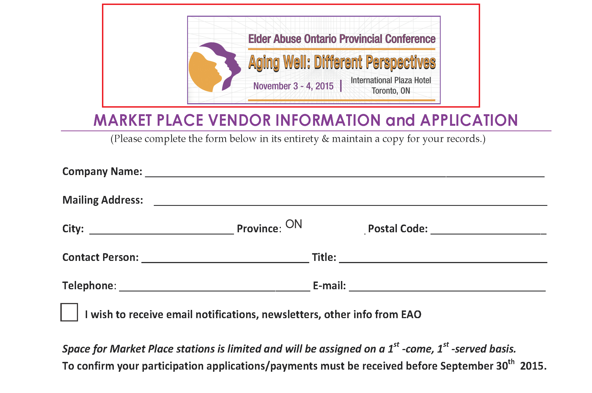
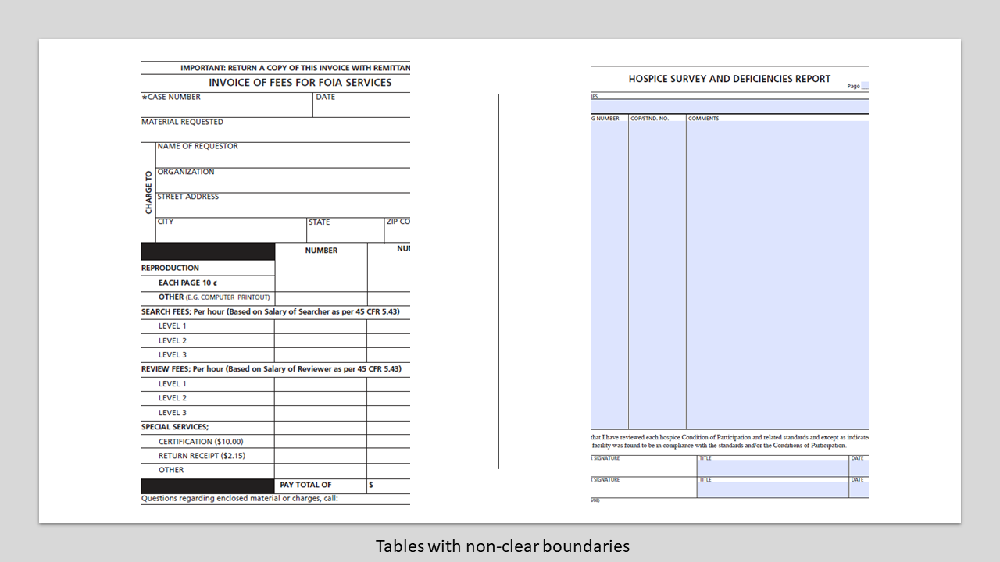
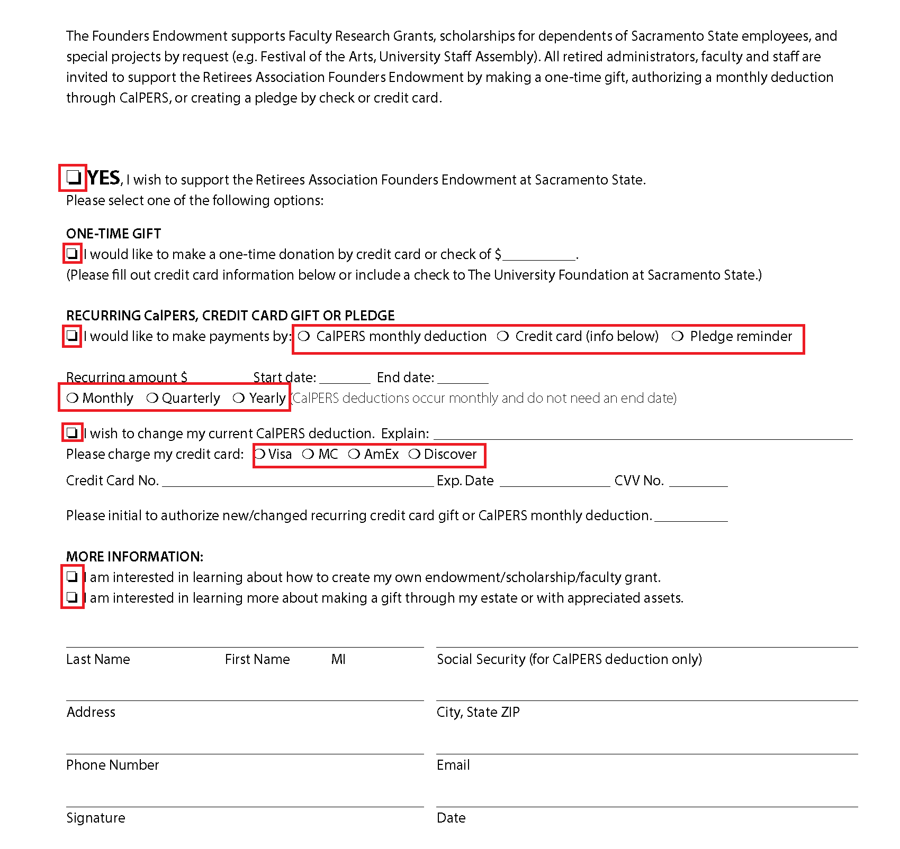
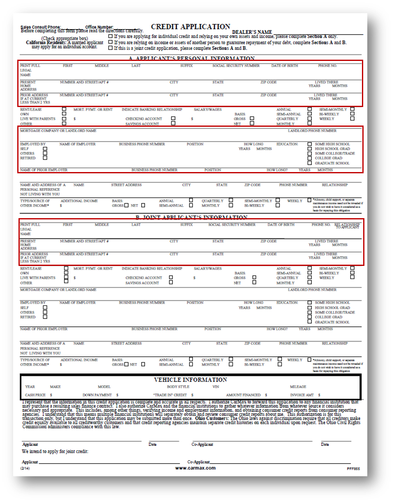
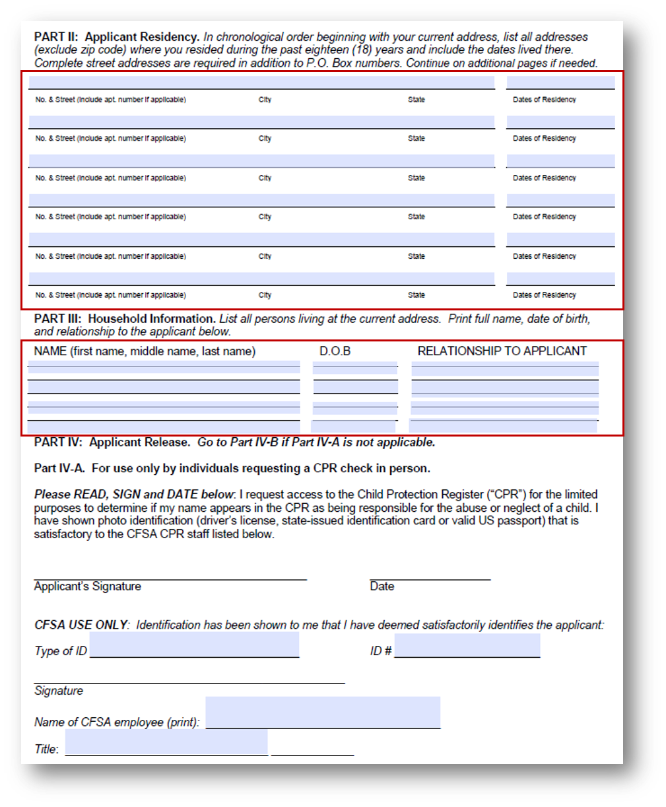
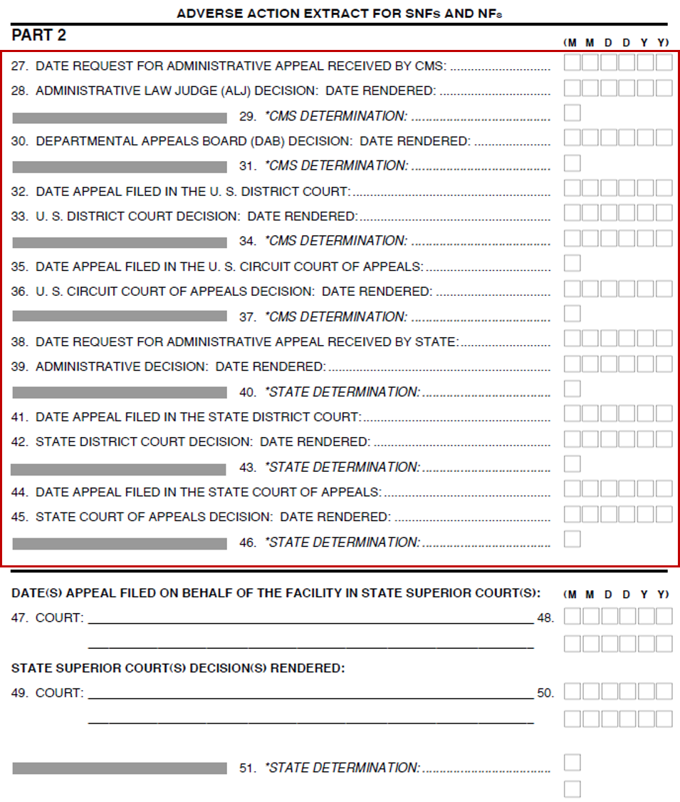
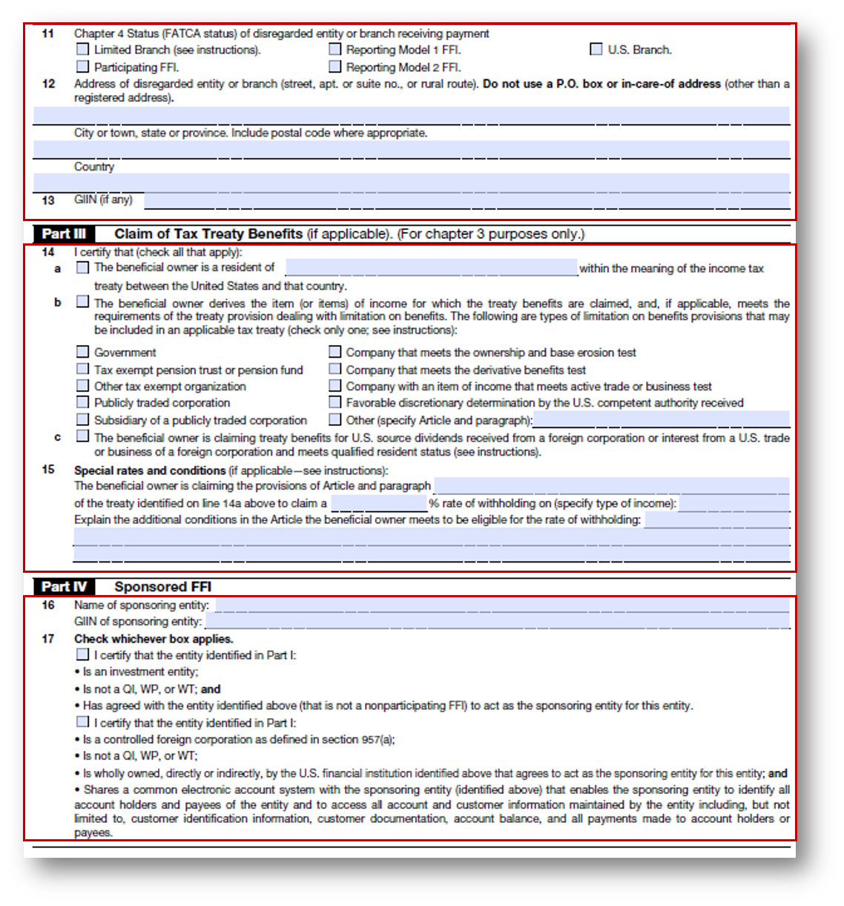
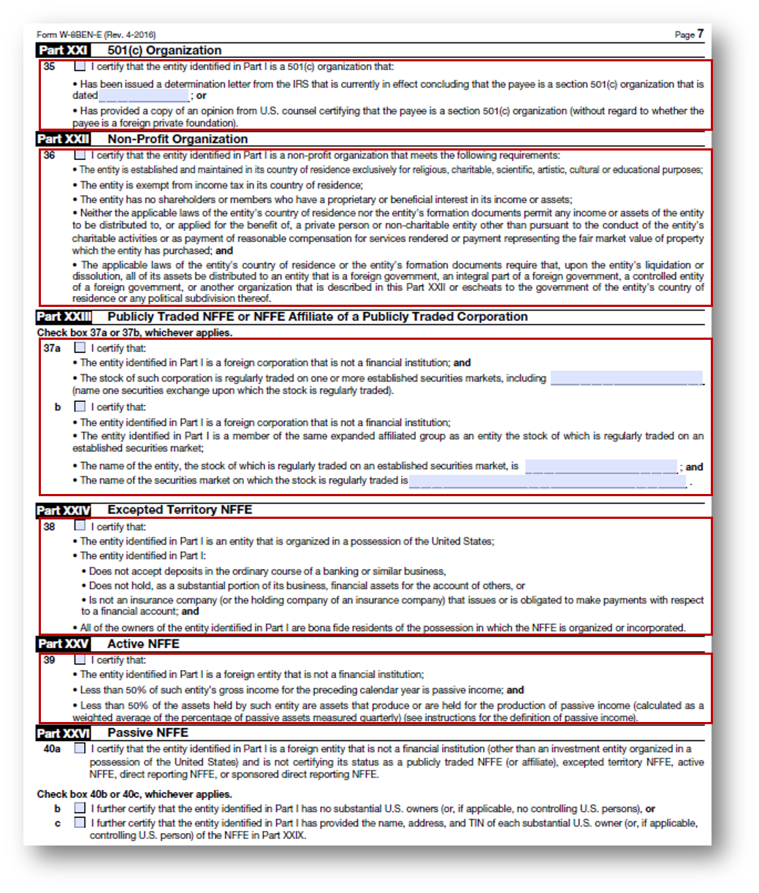
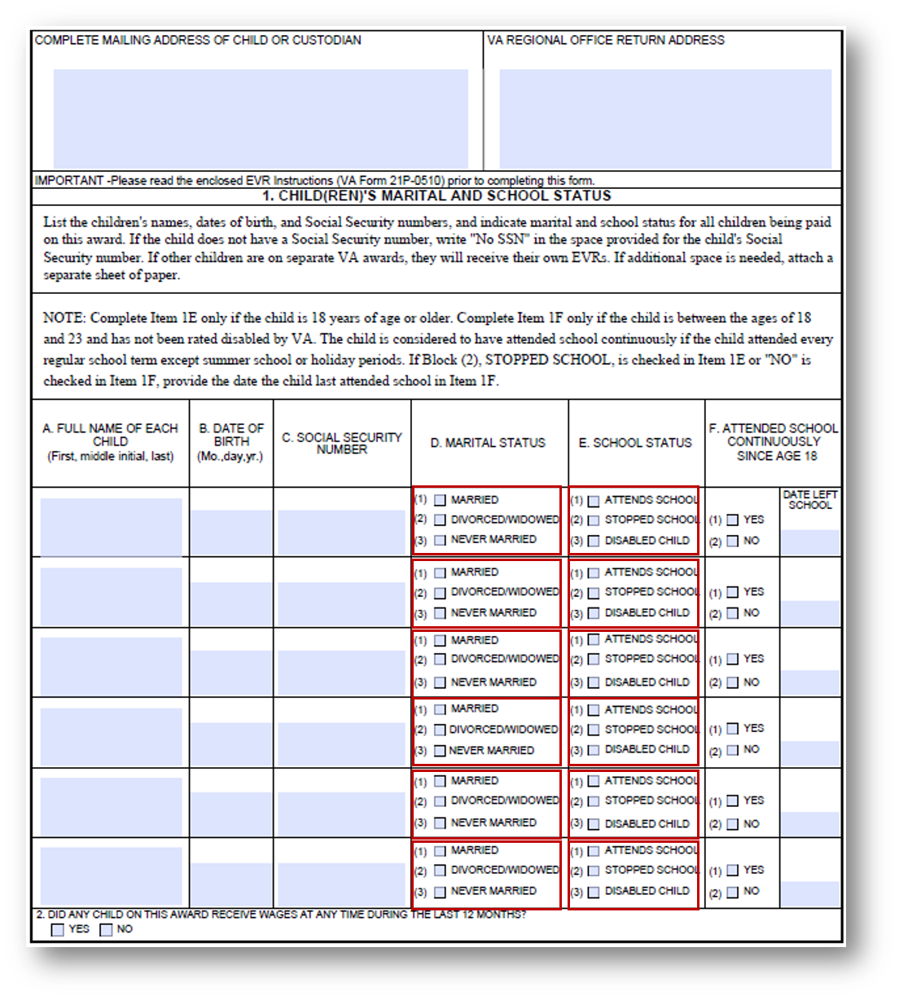

# Procedure consigliate e considerazioni {#do-not-publish-best-practices-and-considerations}

<!--
[DO NOT PUBLISH]
-->

Il servizio di conversione automatica di AEM Forms converte un modulo PDF in un modulo adattivo. Il servizio utilizza algoritmi di intelligenza artificiale e machine learning per comprendere il layout e i campi del modulo sorgente. Ogni servizio di apprendimento automatico apprende continuamente dai dati di origine e produce un output migliorato ad ogni abbandono. Questi servizi imparano dall&#39;esperienza come gli esseri umani.

Il servizio di automated forms conversion viene addestrato su un ampio insieme di moduli. Identifica facilmente i campi in un modulo di origine e produce moduli adattivi. Tuttavia, ci sono alcuni campi e stili nelle PDF forms che sono facilmente visibili all&#39;occhio umano, ma difficili da capire per il servizio. Il servizio può assegnare ad alcuni campi o stili tipi di campi diversi da quelli applicabili. Di seguito sono elencati tutti i modelli di campo e di stile.

Il servizio inizierebbe a identificare e assegnare campi o pannelli corretti a questi modelli man mano che impara dai dati sorgente. Per il momento, puoi utilizzare [Revisione e correzione](review-correct-ui-edited.md) per risolvere tali problemi. Prima di iniziare a risolvere i problemi o leggere ulteriori informazioni, acquisisci familiarità con [componenti modulo adattivo](https://helpx.adobe.com/experience-manager/6-5/forms/using/introduction-forms-authoring.html).

## Generale {#general}

<table border="1" cellpadding="1" cellspacing="0" style="border-collapse: separate; border-spacing: 0px;" width="100%"> 
 <tbody>
  <tr>
   <td width="30%">Modelli noti e risoluzione</td> 
   <td width="70%">Esempio</td> 
  </tr>
   <td>
<strong>Pattern</strong>
 
Il servizio non converte i PDF forms compilati in moduli adattivi.
 
 
 
<strong>Risoluzione</strong>
 
Utilizza moduli adattivi vuoti.
 </td> 
   <td style="text-align: left;"></td> 
  </tr>
  <tr>
   <td>
<strong>Pattern</strong>
 
Il servizio potrebbe non riconoscere il testo e i campi in un modulo denso.
 
 
 
<strong>Risoluzione</strong>
 
Aumenta la larghezza tra il testo e i campi di un modulo denso prima di iniziare la conversione.
 </td> 
   <td style="text-align: left;"></td> 
  </tr>
  <tr>
   <td>
<strong>Pattern</strong>
 
Il servizio non supporta i moduli digitalizzati.
 
 
 
<strong>Risoluzione</strong>
 
Non utilizzare moduli digitalizzati. 
 </td> 
   <td></td> 
  </tr>
  <tr>
   <td>
<strong>Pattern</strong>
 
Il servizio non estrae immagini e testo all’interno delle immagini. 
 
 
 
<strong>Risoluzione</strong>
 
Aggiungere manualmente immagini o testo ai moduli convertiti.
 </td> 
   <td></td> 
  </tr>
  <tr>
   <td>
<strong>Pattern</strong>
 
Le tabelle con bordi punteggiati o non chiari non vengono convertite.
 
<strong>Risoluzione</strong>
 
Utilizzare le tabelle con bordi e bordi espliciti e chiari. supportati.
 </td> 
   <td></td> 
  </tr>
 </tbody>
</table>

## Gruppo di scelta  {#choice-group}

<table border="1" cellpadding="1" cellspacing="0" width="100%"> 
 <tbody>
  <tr>
   <td width="30%">Pattern</td> 
   <td width="70%">Esempio</td> 
  </tr>
  <tr>
   <td>
<strong>Pattern</strong>
 
Le opzioni del gruppo di scelte con forme diverse da riquadro o cerchio non vengono convertite nei corrispondenti componenti del modulo adattivo. 
 
 
 
<strong>Risoluzione</strong>
 
Modificare le opzioni di scelta delle forme in caselle o cerchi oppure utilizzare l'editor di revisione e correzione per identificare le forme.
 </td> 
   <td> </td> 
  </tr>
 </tbody>
</table>

## Campi modulo {#form-fields}

<table border="1" cellpadding="1" cellspacing="0" width="100%"> 
 <tbody>
  <tr>
   <td width="30%">Pattern</td> 
   <td width="70%">Esempio</td> 
  </tr>
  <tr>
   <td width="25%">
<strong>Pattern</strong>
 
Il servizio non identifica i campi senza bordi chiari.
 
 
 
<strong>Risoluzione</strong>
 
Utilizza l’editor di revisione e correzione per identificare tali campi.
 
 
 
 
 </td> 
   <td width="50%">  </td> 
  </tr>
  <tr>
   <td>
<strong>Pattern</strong>
 
Il servizio lascia alcuni campi modulo con didascalie in basso o a destra non identificati.
 
 
 
<strong>Risoluzione</strong>
 
Utilizza l’editor di revisione e correzione per identificare tali campi
 </td> 
   <td>    </td> 
  </tr>
  <tr>
   <td>
<strong>Pattern</strong>
 
Il servizio unisce o assegna un tipo errato ad alcuni campi modulo che sono molto vicini tra loro o che non hanno bordi chiari. 
 
 
 
<strong>Risoluzione</strong>
 
Utilizza l’editor di revisione e correzione per identificare tali campi.
 </td> 
   <td></td> 
  </tr>
  <tr>
   <td>
<strong>Pattern</strong>
 
Il servizio potrebbe non riconoscere i campi con didascalie lontane o con una linea tratteggiata tra la didascalia e il campo di input.
 
 
 
<strong>Risoluzione</strong>
 
Per risolvere questi problemi, utilizza i campi dei moduli con limiti chiari oppure utilizza l’editor di revisione e correzione.
 </td> 
   <td></td> 
  </tr>
 </tbody>
</table>

## Elenchi {#lists}

<table border="1" cellpadding="1" cellspacing="0" width="100%"> 
 <tbody>
  <tr>
   <td width="30%">Pattern</td> 
   <td width="70%">Esempio</td> 
  </tr>
  <tr>
   <td>
<strong>Pattern</strong>
 
Gli elenchi contenenti campi modulo vengono uniti o non convertiti nei corrispondenti componenti del modulo adattivo
 
<strong>Risoluzione</strong>
 
Per risolvere questi problemi, utilizza i campi dei moduli con limiti chiari oppure utilizza l’editor di revisione e correzione.
 </td> 
   <td></td> 
  </tr>
  <tr>
   <td>
<strong>Pattern</strong>
 
Il servizio può lasciare non identificati alcuni elenchi nidificati
 
 
 
<strong>Risoluzione</strong>
 
Per risolvere questi problemi, utilizza l’editor di revisione e correzione.
 </td> 
   <td> </td> 
  </tr>
  <tr>
   <td>
<strong>Pattern</strong>
 
Il servizio unisce tra loro alcuni elenchi contenenti gruppi di scelta
 
<strong>Risoluzione</strong>
 
Per risolvere questi problemi, utilizza l’editor di revisione e correzione.
 </td> 
   <td> </td> 
  </tr>
 </tbody>
</table>

<!--
Comment Type: draft

<h3>Choice groups</h3>
-->

<!--
Comment Type: draft

<ul>
<li>Lists with form fields, nested lists, and nested choice groups are not supported.</li>
<li>Form fields with captions at bottom or right are not supported.</li>
<li>Form fiields without bordes are not supported.</li>
<li>Hidden form fields are not supported.</li>
<li>Button in PDF forms are not converted to adaptive form buttons.  </li>
<li>Tables with clear explicit boundaries and borders are supported.</li>
<li>Fields with far away captions are not supported.  </li>
<li>Choice groups with only box or circle shaped selectors are supported. </li>
</ul>
-->

