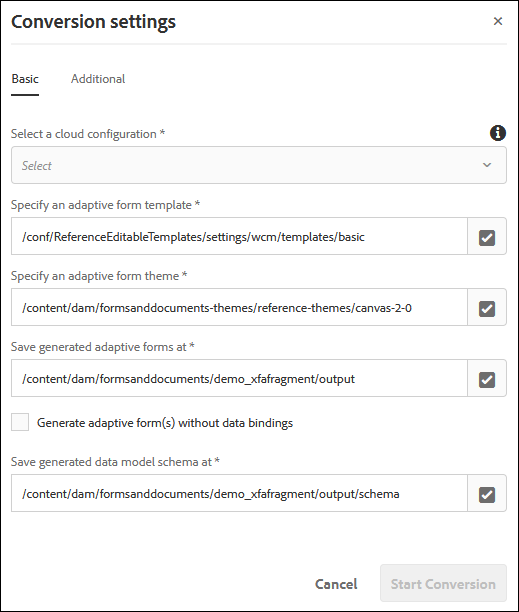

# Conversione di PDF forms in moduli adattivi {#convert-print-forms-to-adaptive-forms}

Il servizio di Automated forms conversion AEM Forms, basato su Adobe Sensei, converte automaticamente i PDF forms in moduli adattivi facili da usare e reattivi. Che si utilizzino PDF forms non interattivi, Acro Forms o PDF forms basati su XFA, il servizio di Automated forms conversion può facilmente convertire questi moduli in moduli adattivi. Per informazioni sulle funzionalità, sul flusso di lavoro di conversione e sull’onboarding consulta [Automated forms conversion](introduction.md) servizio.

## Prerequisiti {#pre-requisites}

* [**Configurare il servizio di conversione**](configure-service.md)

* **Prepara il [modelli](https://helpx.adobe.com/experience-manager/6-5/forms/using/template-editor.html) da applicare ai moduli convertiti:** L’utilizzo di un modello consente di applicare un branding coerente in tutti i moduli adattivi. Inoltre, il servizio di Automated forms conversion non estrae e utilizza l’intestazione e il piè di pagina dei documenti PDF di origine. È possibile utilizzare modelli di modulo adattivi per specificare intestazione e piè di pagina. L’intestazione e il piè di pagina specificati nel modello vengono applicati al modulo adattivo durante la conversione. Quando crei una cartella per i modelli, seleziona la **[!UICONTROL Browse configurations]** per tutti.

* **Prepara il [temi](https://helpx.adobe.com/experience-manager/6-5/forms/using/themes.html) da applicare ai moduli convertiti:** L’utilizzo di un tema consente di applicare uno stile coerente a tutti i moduli adattivi dell’organizzazione.

* **(facoltativo)** [**Conversione dei PDF forms di origine in Adobe Sign form**](frequently-asked-questions.md)

## Avviare il processo di conversione {#start-the-conversion-process}

Dopo aver collegato l’istanza AEM con AEM Forms Conversion Service, puoi convertire i PDF forms in moduli adattivi. Per convertire i moduli, effettuare le seguenti operazioni nell&#39;ordine indicato:

* [Carica PDF forms sul server AEM Forms](convert-existing-forms-to-adaptive-forms.md#upload-pdf-forms-to-your-aem-forms-server)
* [Eseguire la conversione](convert-existing-forms-to-adaptive-forms.md#run-the-conversion)
* [Rivedere e correggere i moduli convertiti](review-correct-ui-edited.md)

### Carica PDF forms sul server AEM Forms {#upload-pdf-forms-to-your-aem-forms-server}

Il servizio di conversione converte i PDF forms disponibili nell’istanza AEM Forms in moduli adattivi. Se necessario, puoi caricare tutti i PDF forms in una sola volta o in modo graduale. Prima di caricare i moduli, considera quanto segue:

* Mantenere il numero di moduli in una cartella inferiore a 15 e il numero totale di pagine in una cartella inferiore a 50.
* Mantieni le dimensioni della cartella inferiori a 10 MB. Non mantenere i moduli in una sottocartella.
* Mantieni il numero di pagine in un modulo inferiore a 15.
* Non caricare i moduli protetti. Il servizio non converte i moduli protetti da password e protetti.
* Non caricare moduli di origine con spazi nel nome file. Rimuovere lo spazio dal nome del file prima di caricare i moduli.
* Non caricare [portfolio PDF](https://helpx.adobe.com/it/acrobat/using/overview-pdf-portfolios.html). Il servizio non converte un Portfolio di PDF in un modulo adattivo.
* Leggi le [Problemi noti](known-issues.md) e [Best practice e considerazioni](styles-and-pattern-considerations-and-best-practices.md) e apportare le modifiche suggerite ai moduli.

Per caricare i moduli da convertire in una cartella nell’istanza AEM Forms, effettua le seguenti operazioni:

1. Accedi all’istanza di AEM Forms.

1. Tocca **[!UICONTROL Adobe Experience Manager]**  > **[!UICONTROL Navigation]**  > **[!UICONTROL Forms]** > **[!UICONTROL Forms & Documents]**.
1. Tocca **[!UICONTROL Create]**> **[!UICONTROL Folder]**. Specifica **Titolo** e **Nome** della cartella. Tocca **[!UICONTROL Create]**. Viene creata una cartella.
1. Tocca per aprire la cartella appena creata.
1. Tocca **[!UICONTROL Create]**> **[!UICONTROL File Upload]**. Seleziona i moduli da caricare, fai clic su **[!UICONTROL Open]** e fai clic su **[!UICONTROL Upload]**. I moduli vengono caricati.

### Eseguire la conversione {#run-the-conversion}

Dopo aver caricato i moduli e configurato il servizio, effettua le seguenti operazioni per avviare la conversione:

1. Nell’istanza di AEM Forms, tocca **[!UICONTROL Adobe Experience Manager]**  > **[!UICONTROL Navigation]**  > **[!UICONTROL Forms]** > **[!UICONTROL Forms & Documents]**.
1. Seleziona un modulo o la cartella contenente i PDF forms (moduli da convertire) e tocca **[!UICONTROL Start Automated Conversion]**. Il **[!UICONTROL Conversion Settings]** viene visualizzata.

   

1. In **[!UICONTROL Basic]** Scheda della finestra di dialogo Impostazioni di conversione:

   * **[!UICONTROL Select a cloud configuration]**. Quando selezioni una configurazione, sono già specificati il modello e il tema predefiniti. Se necessario, puoi specificare un modello o un tema diverso.
   * Specifica una posizione in cui salvare i moduli adattivi generati e lo schema corrispondente. È possibile utilizzare percorsi predefiniti o specificare percorsi personalizzati.
   * Utilizza il **Generare moduli adattivi senza associazioni al modello di dati** opzione per selezionare se generare un modulo adattivo con o senza associazioni al modello di dati.
Se non selezioni questa opzione, il servizio di conversione associa automaticamente i moduli adattivi a uno schema JSON e crea un’associazione dati tra i campi disponibili nel modulo adattivo e lo schema JSON. Il **[!UICONTROL Save generated data model schema at]** mostra la posizione predefinita per salvare lo schema JSON generato. Puoi anche personalizzare la posizione per salvare lo schema generato.
Se selezioni questa opzione, il servizio di conversione genera un modulo adattivo senza associazioni del modello di dati. Dopo una conversione riuscita, puoi associare un modulo adattivo a un modello dati modulo, a uno schema XML o a uno schema JSON. Per ulteriori informazioni, consulta [Creazione di un modulo adattivo](https://helpx.adobe.com/experience-manager/6-5/forms/using/creating-adaptive-form.html).

   <!--

   Comment Type: draft

   <note type="note">
   
The XDP or XFA-based PDF form is not used to generate the Document of Record. The conversion service auto-generates the Document of Record only if you enable the Tools &gt; Cloud Services &gt; Automated Forms Conversion Configuration &gt; <strong>&lt;Properties of selected configuration&gt; &gt;</strong> Advanced &gt; Generate Document of Record option.

   
 

   </note>
   -->

1. In **[!UICONTROL Additional]** scheda della finestra di dialogo Impostazioni di conversione,
   * Seleziona la **[!UICONTROL Extract fragment from adaptive forms]** per consentire al servizio di conversione di identificare, estrarre e scaricare frammenti di modulo per i moduli convertiti. Quando selezioni il **[!UICONTROL Extract fragment from adaptive forms]** , sono abilitate le opzioni per specificare i percorsi per il salvataggio dei frammenti di modulo estratti e degli schemi di frammenti di modulo corrispondenti.
   * Specifica il percorso di **[!UICONTROL existing adaptive form fragments]**, se disponi di alcuni frammenti di moduli JSON basati su schema e meno adattivi per schema e intendi utilizzarli in moduli adattivi generati automaticamente. Il servizio di conversione rileva la presenza di frammenti di moduli adattivi basati su schema JSON disponibili e di frammenti di moduli meno adattivi con PDF forms di input (solo PDF forms non interattivi). In caso di corrispondenza, nei moduli adattivi corrispondenti viene utilizzato il frammento di modulo adattivo corrispondente.

   >[!NOTE]
   >
   >
   > * Puoi utilizzare solo **[!UICONTROL  Extract Fragment]** o **[!UICONTROL Use existing adaptive form fragments]** alla volta. Non è possibile utilizzare entrambe le opzioni contemporaneamente.
   > * È possibile utilizzare **[!UICONTROL Use existing adaptive form fragments]** solo con PDF forms non interattivi. Altri tipi di modulo non sono ancora supportati.
   > * Con il servizio di conversione automatica è possibile utilizzare solo frammenti non associati o frammenti associati a uno schema JSON. Non utilizzare frammenti XFA. Frammenti XFA non supportati.
   >

   * Seleziona la **[!UICONTROL Auto-detect multi-column layout of input forms]** opzione per mantenere il layout del modulo di origine per schermi di grandi dimensioni come desktop e notebook. Questa opzione è utile per mantenere il layout a più colonne dei moduli di origine. Ad esempio, quando un PDF sorgente ha un layout a due colonne, il servizio genera un modulo adattivo di output con un layout a due colonne per schermi di grandi dimensioni e un layout a colonna singola per dispositivi con schermo di piccole dimensioni come i telefoni cellulari. La funzione presenta alcuni problemi noti con la struttura dello schema dell’origine dati. Per ulteriori informazioni, vedere [problemi noti](known-issues.md) articolo.
   * Per impostazione predefinita, il servizio crea un pannello di primo livello separato per ciascuna pagina di un modulo PDF. Ora è possibile utilizzare **[!UICONTROL Auto-detect logical sections]** opzione per non creare pannelli a livello di pagina (pannelli basati sul numero di pagina) e creare solo pannelli logici. Questa opzione, inoltre, unisce alla sezione logica precedente i campi che non appartengono ad alcuna sezione e unisce in un’unica sezione logica i campi di una sezione logica suddivisi su due pagine adiacenti. Ad esempio, se alcuni campi di una sezione logica si trovano alla fine della pagina 1 e altri si trovano all’inizio della pagina 2, tutti questi campi sono raggruppati in una singola sezione logica.

     >[!NOTE]
     > Per utilizzare il connettore è necessario il pacchetto 1.1.38 o versioni successive  **[!UICONTROL Auto-detect logical sections]** funzionalità.

* (Solo AEM Forms as a Cloud Service) Il [Conversione automatica di sezioni in frammenti] L’opzione è applicabile ai PDF forms con più di 15 pagine. Converte le sezioni di primo livello rilevate in frammenti. Inoltre, consente il caricamento lento di tutti i frammenti creati. Consente di migliorare la velocità di rendering dei moduli convertiti e di caricare più facilmente i moduli di grandi dimensioni nell’editor di moduli adattivi.

  >[!NOTE]
  > Non utilizzare il modello di layout dinamico quando si utilizza l’opzione Converti automaticamente sezioni in frammenti.
  > Utilizza l’editor di revisione e correzione per unire i pannelli di piccole dimensioni a uno di grandi dimensioni. Consente di ridurre il numero di frammenti nel modulo adattivo convertito.
  > Se si verifica l’eccezione &quot;Troppe chiamate&quot;,
  >
  > * ristrutturare il modulo per creare una gerarchia semplificata
  > * [aumenta il valore del parametro sling.max.calls]a un numero sufficientemente alto finché l&#39;eccezione non scompare.
  > * [aumentare la dimensione della cache](https://experienceleague.adobe.com/docs/experience-manager-65/forms/install-aem-forms/configure-aem-forms/configure-adaptive-forms-cache.html). L&#39;errore si verifica se il modulo è troppo complesso, presenta un numero elevato di tabelle e una struttura gerarchica a più livelli.

1. Tocca **[!UICONTROL Start Conversion]**. La conversione viene avviata. L’avanzamento della conversione viene visualizzato nella cartella o nel modulo fino a quando la conversione non è in corso. Al termine della conversione, il messaggio viene sostituito da un altro messaggio di stato (Convertito, Parzialmente convertito o Conversione non riuscita). Al termine della conversione, sull’indirizzo e-mail configurato viene inviato anche un messaggio e-mail di stato:

   * In caso di conversione corretta, il modulo adattivo convertito e lo schema correlato vengono scaricati nel percorso specificato nella **[!UICONTROL Basic]** della finestra di dialogo di conversione. I frammenti di modulo e lo schema corrispondente vengono scaricati solo se l’opzione Estrai frammento è selezionata prima di avviare la conversione.
   * In caso di conversione non riuscita, il **[!UICONTROL Conversion Failed]** viene visualizzato se non è possibile convertire tutti i moduli di input o il **[!UICONTROL Partially Failed]** viene visualizzato un messaggio quando solo alcuni di tutti i moduli di input non vengono convertiti. Un messaggio e-mail di stato viene inviato il [indirizzo e-mail configurato](configure-service.md#configureemailnotification) e viene registrato un errore nel file error.log.

   Se stai convertendo un modulo PDF basato su XFA in un modulo adattivo, il servizio di conversione associa automaticamente il modulo PDF al modulo adattivo convertito come modello del documento di record. Dopo la conversione, puoi aprire le proprietà del modulo adattivo per visualizzare il modello del Documento di record nel **[!UICONTROL Document of Record Template Configuration]** sezione di **[!UICONTROL Form Model]** scheda.  

   Il servizio di conversione carica automaticamente il modulo PDF nel modulo adattivo convertito come modello del documento di record solo se si abilita **[!UICONTROL Tools]** > **[!UICONTROL Cloud Services]** > **[!UICONTROL Automated Forms Conversion Configuration]** > **[!UICONTROL Properties of selected configuration]** > **[!UICONTROL Advanced]** > **[!UICONTROL Generate Document of Record]** opzione.

   <!--

   Comment Type: draft

   <note type="note">
   
By default, the adaptive form produces a JSON schema instead of XML schema on submission. JSON schema of a converted adaptive form is complaint with XML schema of an XFA-based form. You can use the <a href="https://sling.apache.org/apidocs/sling5/org/apache/sling/commons/json/xml/XML.html#toString">org.apache.sling.commons.json.xml API</a> to convert a JSON schema to XML schema. You can also use the following sample code for conversion:

   
<code class="code">import org.apache.sling.commons.json.JSONException;
   <discoiqbr /> import org.apache.sling.commons.json.JSONObject;
   <discoiqbr /> import org.apache.sling.commons.json.xml.XML;
   <discoiqbr />
   <discoiqbr /> public class ConversionUtils {
   <discoiqbr />
   <discoiqbr /> public static String jsonToXML(String jsonString) throws JSONException {
   <discoiqbr /> //https://sling.apache.org/apidocs/sling5/org/apache/sling/commons/json/xml/XML.html#toString(java.lang.Object)
   <discoiqbr /> //jar - http://maven.ibiblio.org/maven2/org/apache/sling/org.apache.sling.commons.json/2.0.18/
   <discoiqbr /> //Note: Need to extract boundData part before converting to XML
   <discoiqbr /> return XML.toString(new JSONObject(jsonString));
   <discoiqbr /> }
   <discoiqbr /> }</code>  

   </note>
   -->

   >[!NOTE]
   >
   >Se il processo di conversione richiede più di 60 minuti e il modulo PDF non viene ancora convertito in un modulo adattivo, crea una cartella nell’istanza di AEM Forms, carica il modulo PDF nella cartella appena creata e riavvia la conversione.

## Rivedere e correggere i moduli convertiti {#review-and-correct-the-converted-forms}

I moduli del mondo reale hanno requisiti di acquisizione dati complessi. Una volta completata la conversione automatica, i clienti possono rivedere la qualità della conversione del modulo e apportare i necessari aggiornamenti al modulo. AEM Forms fornisce una [rivedere e correggere](review-correct-ui-edited.md) per apportare le modifiche necessarie. Consente di migliorare l’identificazione automatica dei campi modulo e di convertire i campi identificati da un tipo all’altro. È ad esempio possibile identificare il layout a due colonne di un modulo e modificare un campo identificato automaticamente come pulsante di scelta in un campo a più scelte.
