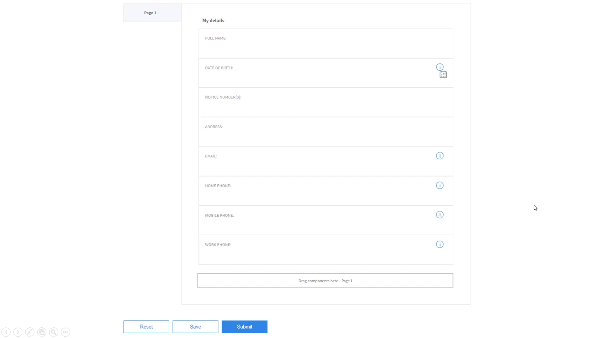

# Workflow di abilitazione della generazione di documenti di record consigliati per i moduli adattivi {#recommended-workflows-dor-generation}

Il documento di record (DoR) consente di conservare una registrazione delle informazioni fornite e di inviarle in un modulo adattivo in modo da potervi fare riferimento in un secondo momento.
Il DoR utilizza un modello base per definirne il layout. Puoi generare un DoR utilizzando un modello predefinito o associando qualsiasi altro modello al modulo adattivo.

Per ulteriori informazioni sulla generazione di un documento record, vedi [Generare un documento di record per i moduli adattivi](https://helpx.adobe.com/experience-manager/6-5/forms/using/generate-document-of-record-for-non-xfa-based-adaptive-forms.html).

Il [servizio automated forms conversion](/help/using/introduction.md) converte i seguenti moduli sorgente in moduli adattivi:

* PDF forms non interattivi
* Acro Forms
* PDF forms basati su XFA

In base al modulo di origine utilizzato per la conversione, è possibile generare un documento record utilizzando:

* un modello predefinito
* modulo di origine come modello: se selezioni questa opzione, il servizio di conversione associa automaticamente il modulo di origine al modulo adattivo convertito come modello DoR.
* associa qualsiasi altro modello al modulo adattivo convertito

Nella tabella seguente viene illustrato un esempio dell&#39;effetto del modello DoR utilizzato sul layout del DoR generato:

<table> 
 <tbody>
 <tr>
  <td>
<strong>Modulo di origine</strong>
</td>
  <td>
<strong>DoR generato</strong>
</td> 
   </tr>
  <tr>
   <td></td>
   <td>
Se si utilizza il modello predefinito per generare DoR: </td>
   </tr>
   <tr>
   <td></td>
   <td>
Se si utilizza il modulo di origine come modello per generare DoR: 
</td>
   </tr>
  </tbody>
</table>

Come illustrato nella tabella, se si utilizza il modulo di origine come modello, il DoR mantiene il layout del modulo di origine.
Questo articolo descrive i percorsi consigliati per generare un DoR basato sui tre tipi di moduli di origine.

<table> 
 <tbody> 
  <tr> 
   <th><strong>Modulo di origine</strong></th> 
   <th><strong>Metodi per generare il DoR</strong></th> 
  </tr> 
  <tr> 
   <td>
PDF forms non interattivi
</td> 
   <td> 
    <ul> 
     <li><a href="#generate-document-of-record-using-cloud-configuration">Abilita la generazione DoR prima della conversione del modulo adattivo per generare DoR utilizzando un modello predefinito</a></li> 
     <li><a href="#edit-adaptive-form-properties-generate-document-of-record">Modifica le proprietà del modulo adattivo dopo la conversione del modulo adattivo per abilitare la generazione DoR utilizzando l’impostazione predefinita o qualsiasi altro modello di modulo</a></li> 
    </ul> </td> 
  </tr>
  <tr> 
   <td>
Acro Forms o PDF forms basati su XFA
</td> 
   <td> 
    <ul> 
     <li><a href="#use-input-form-as-template-to-generate-document-of-record">Abilita la generazione DoR prima della conversione del modulo adattivo per generare DoR utilizzando il modulo di origine come modello</a></li> 
     <li><a href="#edit-adaptive-form-properties-to-generate-document-of-record">Modifica le proprietà del modulo adattivo dopo la conversione del modulo adattivo per abilitare la generazione DoR utilizzando il modello predefinito, il modulo di origine come modello o qualsiasi altro modello di modulo</a></li> 
    </ul> </td> 
  </tr>    
 </tbody> 
</table>

## Genera documento di record per PDF forms non interattivi {#generate-document-of-record-non-interactive-pdf}

Se si utilizza un modulo di PDF non interattivo come modulo di origine per il servizio di Automated forms conversion, è possibile:

* abilitare la generazione DoR prima della conversione del modulo adattivo per generare DoR utilizzando un modello predefinito
* o modificare le proprietà dei moduli adattivi dopo la conversione dei moduli adattivi per abilitare la generazione DoR utilizzando l’impostazione predefinita o qualsiasi altro modello di modulo

### Abilita generazione DoR prima della conversione per generare DoR utilizzando il modello predefinito {#generate-document-of-record-using-cloud-configuration}

1. Seleziona **[!UICONTROL Tools]** > **[!UICONTROL Cloud Services]** > **[!UICONTROL Automated Forms Conversion Configuration]** > Proprietà della configurazione cloud utilizzate per la conversione > **[!UICONTROL Advanced]** > **[!UICONTROL Generate Document of Record]** opzione.

   

1. Tocca **[!UICONTROL Save & Close]** per salvare le impostazioni.

1. [Eseguire la conversione](/help/using/convert-existing-forms-to-adaptive-forms.md). Assicurati di utilizzare la configurazione cloud modificata nel passaggio 1 di queste istruzioni.
All’invio del modulo adattivo convertito, il DoR viene generato automaticamente utilizzando il modello predefinito.

### Modifica le proprietà del modulo adattivo dopo la conversione per abilitare la generazione DoR {#edit-adaptive-form-properties-generate-document-of-record}

Se non abiliti la generazione DoR prima di convertire il modulo di origine in un modulo adattivo, puoi comunque farlo dopo la conversione.

1. [Eseguire la conversione](/help/using/convert-existing-forms-to-adaptive-forms.md) sul modulo PDF non interattivo per generare un modulo adattivo.

1. Seleziona il modulo adattivo nel **[!UICONTROL output]** cartella e tocca **[!UICONTROL Properties]**.

1. In **[!UICONTROL Form Model]** , espandere la scheda **[!UICONTROL Document of Record Template Configuration]** sezione e seleziona **[!UICONTROL Generate Document of Record]**.

   

1. Tocca **[!UICONTROL Save & Close]** per salvare le impostazioni.

All’invio del modulo adattivo convertito, il DoR viene generato automaticamente utilizzando il modello predefinito. Per associare qualsiasi altro modello DoR al modulo adattivo convertito, puoi selezionare **[!UICONTROL Associate form template as the Document of Record template]** opzione.

## Genera documento di record per PDF forms basati su Acro Forms o XFA {#generate-document-of-record-acroform-xfaform}

Se si utilizza un modulo Acro Form o un modulo PDF basato su XFA come modulo di origine per il servizio di Automated forms conversion, è possibile:

* abilitare la generazione DoR prima della conversione del modulo adattivo per generare DoR utilizzando il modulo di origine come modello

* o modificare le proprietà dei moduli adattivi dopo la conversione dei moduli adattivi per abilitare la generazione DoR utilizzando come modello predefinito il modello di modulo di origine o qualsiasi altro modello di modulo

### Abilita generazione DoR prima della conversione per generare DoR utilizzando il modello del modulo di origine {#use-input-form-as-template-to-generate-document-of-record}

1. Seleziona **[!UICONTROL Tools]** > **[!UICONTROL Cloud Services]** > **[!UICONTROL Automated Forms Conversion Configuration]** > Proprietà della configurazione cloud utilizzate per la conversione > **[!UICONTROL Advanced]** > **[!UICONTROL Generate Document of Record]** opzione.

1. Tocca **[!UICONTROL Save & Close]** per salvare le impostazioni.

1. [Eseguire la conversione](/help/using/convert-existing-forms-to-adaptive-forms.md). Assicurati di utilizzare la configurazione cloud modificata nel passaggio 1 di queste istruzioni.
Il servizio di conversione associa automaticamente il modulo Acro Form o il modulo PDF basato su XFA al modulo adattivo convertito come modello DoR.
È possibile aprire le proprietà del modulo adattivo per visualizzare il modello DoR in **[!UICONTROL Document of Record Template Configuration]** sezione di **[!UICONTROL Form Model]** scheda.

   

   All’invio del modulo adattivo convertito, il DoR viene generato automaticamente utilizzando il modello di modulo di origine.

### Modifica le proprietà del modulo adattivo dopo la conversione per abilitare la generazione DoR {#edit-adaptive-form-properties-to-generate-document-of-record}

1. [Eseguire la conversione](/help/using/convert-existing-forms-to-adaptive-forms.md) sul modulo PDF non interattivo per generare un modulo adattivo.

1. Seleziona il modulo adattivo nel **[!UICONTROL output]** cartella e tocca **[!UICONTROL Properties]**.

1. In **[!UICONTROL Form Model]** , espandere la scheda **[!UICONTROL Document of Record Template Configuration]** sezione e seleziona **[!UICONTROL Generate Document of Record]** per abilitare la generazione DoR utilizzando il modello predefinito.
È inoltre possibile selezionare **[!UICONTROL Associate form template as the Document of Record template]** e selezionare il modello per abilitare la generazione DoR utilizzando il modello di modulo di origine o qualsiasi altro modello di modulo.

1. Tocca **[!UICONTROL Save & Close]** per salvare le impostazioni.
