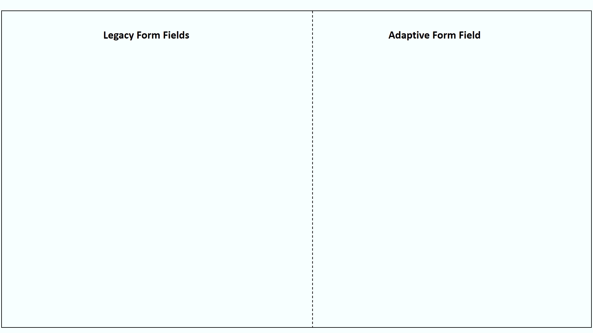
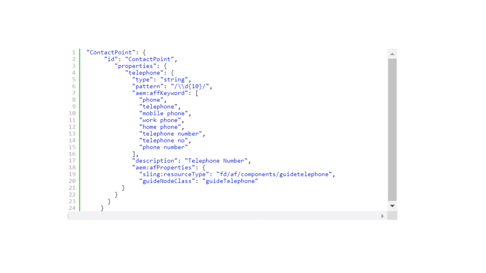
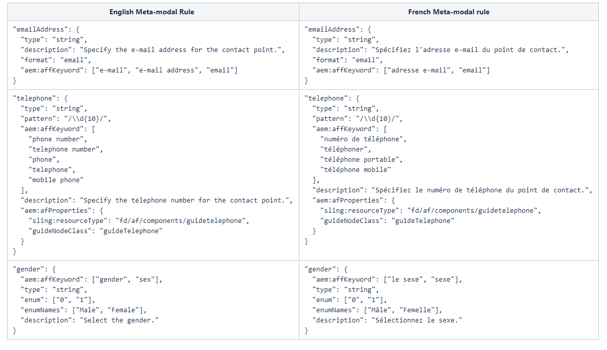

# Estensione del metamodello predefinito {#extend-the-default-meta-model}

Il servizio di automated forms conversion identifica ed estrae gli oggetti modulo dai moduli di origine. La funzione di mappatura semantica consente al servizio di decidere in che modo gli oggetti estratti vengono rappresentati in un modulo adattivo. Ad esempio, un modulo di origine può avere diversi tipi di rappresentazioni di una data. La mappatura semantica consente di mappare tutte le rappresentazioni degli oggetti modulo data del modulo di origine con il componente data dei moduli adattivi. La funzione di mappatura semantica consente inoltre al servizio di preconfigurare e applicare convalide, regole, pattern di dati, testo della Guida e proprietà di accessibilità ai componenti dei moduli adattivi durante la conversione.



Il metamodello è uno schema JSON. Prima di iniziare con il metamodello, assicurati di avere familiarità con JSON. È necessaria un’esperienza di creazione, modifica e lettura dei dati salvati in formato JSON.

## Metamodello predefinito {#default-meta-model}

Il servizio di automated forms conversion dispone di un metamodello predefinito. Si tratta di uno schema JSON che risiede su Adobe Cloud con altri componenti del servizio di Automated forms conversion. Puoi trovare una copia del metamodello sul tuo server AEM locale all’indirizzo: http://&lt;server>:&lt;port>/aem/forms.html/content/dam/formsanddocuments/metamodel/`global.schema.json`. È inoltre possibile [fai clic qui](assets/en.globalschema.json) per accedere o scaricare lo schema in lingua inglese. Il metamodello per [Francese](assets/fr.globalschema.json), [Tedesco](assets/de.globalschema.json) [Spagnolo](assets/es.globalschema.json), [Italiano](assets/it.globalschema.json), e [Portoghese](assets/pt_br.globalschema.json) sono disponibili per il download anche le lingue.

Lo schema del metamodello deriva dalle entità dello schema in https://schema.org/docs/schemas.html. Dispone di Persona, IndirizzoPostale, LocalBusiness e più entità come definito su https://schema.org. Ogni entità del metamodello aderisce al tipo di oggetto dello schema JSON. Il codice che segue rappresenta una struttura di metamodello di esempio:

```
   "Entity": {
      "id": "Entity",
      "properties": {
        "name": {
          "type": "string"
        },

        "description": {
          "type": "string",
          "description": "Description of the item"
        }
      }
    }
```

## Scarica il metamodello predefinito {#download-the-default-meta-model}

Per scaricare il metamodello predefinito nel file system locale, effettua le seguenti operazioni:

1. Accedi all’istanza di AEM Forms.
1. Accedi a **[!UICONTROL Forms]** > **[!UICONTROL Forms & Documents]** **>** **[!UICONTROL Meta Model]** cartella.
1. Seleziona la **[!UICONTROL global.schema.json]** file e tocca **[!UICONTROL Download]**. Viene visualizzata una finestra di dialogo per il download. Seleziona la **[!UICONTROL Download asset(s) as binary files]** opzione. Tocca **[!UICONTROL Download]**. Viene scaricato un archivio.

   <!--
   Comment Type: draft

   <li><p>Extract the archive and open the global.schema.json file for editing. </p> </li>
   -->

   <!--
   Comment Type: draft

   <li>Step text</li>
   -->

## Informazioni sul metamodello {#understanding-the-meta-model}

Un metamodello fa riferimento a un file di schema JSON che contiene entità. Tutte le entità nel file dello schema JSON includono un nome e un ID. Ogni entità può includere più proprietà. Le entità e le relative proprietà possono variare in base al dominio. Puoi migliorare un file di schema con parole chiave e configurazioni di campi per mappare le proprietà dello schema ai componenti del modulo adattivo.

```
"Event": {
      "id": "Eventid",
      "allOf": [
        {
          "$ref": "#Entity"
        },
        {
          "properties": {
            "startDate": {
              "type": "string",
              "format": "date",
              "description": "Specify the start date and time of the event in ISO 8601 date format."
            },
            "endDate": {
              "type": "string",
              "format": "date",
              "description": "Specify the end date and time of the event in ISO 8601 date format."
            },
            "location": {
              "$ref": "#PostalAddress",
              "description": "Specify the location of the event."
            }
          }
        }
      ]
    }
```

In questo esempio, **Evento** rappresenta il nome di un’entità con un valore per **id** as **Eventid**. L’entità Event include più proprietà:

* startDate
* endDate
* luogo

Il **allOf** costrutto nel metamodello consente l’ereditarietà tra le entità.

Ogni proprietà può inoltre includere:

* [Proprietà schema JSON](#jsonschemaproperties)
* [Ricerca basata su parole chiave per applicare proprietà ai campi del modulo adattivo generati](#keywordsearch)
* [Proprietà aggiuntive](#additionalproperties)



In base alle parole chiave a cui si fa riferimento utilizzando **aem:affKeyword**, il servizio di conversione esegue un&#39;operazione di ricerca nei campi del modulo di origine. Il servizio di conversione applica le proprietà dello schema JSON e proprietà aggiuntive ai campi che soddisfano i criteri di ricerca.

In questo esempio, il servizio di conversione cerca le parole chiave relative a telefono, telefono, cellulare, telefono di lavoro, telefono di casa, numero di telefono, numero di telefono e numero di telefono nel modulo di origine. In base ai campi che includono queste parole chiave, il servizio di conversione applica il tipo, il pattern e aem:afProperties ai campi del modulo adattivo dopo la conversione.

### Proprietà dello schema JSON per i campi del modulo adattivo generati {#jsonschemaproperties}

Il metamodello supporta le seguenti proprietà comuni dello schema JSON per i campi del modulo adattivo generati utilizzando il servizio di Automated forms conversion:

<table> 
 <tbody> 
  <tr> 
   <th><strong>Nome proprietà</strong></th> 
   <th><strong>Descrizione</strong></th> 
  </tr> 
  <tr> 
   <td><p>titolo</p></td> 
   <td> 
    <p>Il testo menzionato all’interno della proprietà title in un metamodello funge da parola chiave di ricerca per eseguire azioni sui campi del modulo adattivo generato. Ad esempio, modificando l’etichetta di un campo modulo adattivo. Per ulteriori informazioni, consulta <strong>Modificare l’etichetta di un campo modulo</strong> in <a href="#custommetamodelexamples">Esempi di metamodello personalizzati.</a></p> </td> 
  </tr>
  <td><p>descrizione</p></td> 
   <td> 
    <p>La proprietà description imposta il testo della Guida per il campo modulo adattivo generato. Per ulteriori informazioni, consulta <strong>Aggiungere testo della Guida a un campo modulo</strong> in <a href="#custommetamodelexamples">Esempi di metamodello personalizzati.</a></p> </td> 
  </tr>
  <td><p>tipo</p></td> 
   <td> 
    <p>La proprietà type definisce il tipo di dati per il campo modulo adattivo generato. I valori possibili per la proprietà title includono:</p>
    <ul> 
     <li>stringa: genera un campo modulo adattivo di tipo testo.</li> 
     <li>number: genera un campo modulo adattivo di tipo dati numerico.</li>
     <li>integer: genera un campo modulo adattivo di tipo dati numerico con sottotipo impostato su integer.</li>
     <li>booleano: genera un componente modulo adattivo sostitutivo.</li>
     </ul><p>Per ulteriori informazioni sull’utilizzo della proprietà type in un metamodello, consulta <strong>Modificare il tipo di un campo modulo</strong> in <a href="#custommetamodelexamples">Esempi di metamodello personalizzati.</a></p></td> 
  </tr>
  <td><p>pattern</p></td> 
   <td> 
    <p>La proprietà pattern limita il valore del campo modulo adattivo generato basato su un’espressione regolare. Ad esempio, il seguente codice nel metamodello limita a dieci cifre il valore per il campo del modulo adattivo generato:<br>"pattern": "/\\d{10}/"<br>Analogamente, il codice seguente nel metamodello limita il valore di un campo a un formato di data specifico.<br> "pattern": "date{DD MMMM, YYYY}",</p> </td> 
  </tr>
  <td><p>formato</p></td> 
   <td> 
    <p>La proprietà format limita il valore del campo modulo adattivo generato in base a un pattern denominato anziché a un’espressione regolare. I valori possibili per la proprietà format includono:<ul><li>e-mail: genera un componente modulo adattivo e-mail.</li><li>hostname: genera un componente modulo adattivo casella di testo.</li></ul>Per ulteriori informazioni sull'utilizzo della proprietà format in un metamodello, consultate <strong>Modificare il formato di un campo modulo</strong> in <a href="#custommetamodelexamples">Esempi di metamodello personalizzati.</a></p> </td> 
  </tr>
  <td><p>enum ed enumNames</p></td> 
   <td> 
    <p>Le proprietà enum e enumNames limitano i valori dei campi elenco a discesa, casella di controllo o pulsante di scelta a un set fisso. I valori elencati in enumNames vengono visualizzati nell'interfaccia utente. I valori elencati utilizzando la proprietà enum vengono utilizzati per il calcolo.<br>Per ulteriori informazioni, consulta <strong>Convertire un campo modulo in caselle di controllo a scelta multipla nel modulo adattivo</strong>, <strong>Convertire un campo di testo in un elenco a discesa nel modulo adattivo</strong>, e <strong>Aggiungi opzioni aggiuntive all’elenco a discesa</strong> in <a href="#custommetamodelexamples">Esempi di metamodello personalizzati.</a></p> </td> 
  </tr>
 </tbody> 
</table>

### Ricerca basata su parole chiave per applicare proprietà ai campi del modulo adattivo generati {#keywordsearch}

Il servizio di automated forms conversion esegue una ricerca per parola chiave nel modulo di origine durante la conversione. Dopo aver filtrato i campi che soddisfano i criteri di ricerca, il servizio di conversione applica le proprietà definite per tali campi nel metamodello ai campi del modulo adattivo generato.

Le parole chiave sono referenziate utilizzando **aem:affKeyword** proprietà.

```
{
  "numberfields": {
      "type": "number",
      "aem:affKeyword": ["Bank account number"]
 }
}
```

In questo esempio, il servizio di conversione utilizza il testo **aem:affKeyword** come parola chiave di ricerca. Dopo aver recuperato **Numero conto bancario** nel modulo, il servizio di conversione converte il campo in un **numero** digita utilizzando **tipo** proprietà.

### Proprietà aggiuntive per i campi modulo adattivo generati {#additionalproperties}

È possibile utilizzare **aem:afProperties** proprietà nel metamodello per definire le seguenti proprietà aggiuntive per i campi dei moduli adattivi generati utilizzando il servizio di Automated forms conversion:

<table> 
 <tbody> 
  <tr> 
   <th><strong>Nome proprietà</strong></th> 
   <th><strong>Descrizione</strong></th> 
  </tr> 
  <tr> 
   <td><p>multiLine</p></td> 
   <td> 
    <p>La proprietà multiLine converte un campo del modulo di origine in un campo con più righe nel modulo adattivo dopo la conversione. Per ulteriori informazioni, consulta <strong>Convertire un campo stringa in un campo a più righe</strong> in <a href="#custommetamodelexamples">Esempi di metamodello personalizzati.</a></p> </td> 
  </tr>
  <td><p>obbligatorio</p></td> 
   <td> 
    <p>La proprietà required imposta come obbligatorio l’input per un campo di un modulo adattivo dopo la conversione.<br>Per ulteriori informazioni, consulta <strong>Aggiungere convalide ai campi del modulo adattivo</strong> in <a href="#custommetamodelexamples">Esempi di metamodello personalizzati.</a></p>
    </td> 
  </tr>
  <td><p>jcr:title</p></td> 
   <td> 
    <p>La proprietà jcr:title, con la proprietà schema JSON title, consente di modificare l’etichetta di un campo di un modulo adattivo dopo la conversione.<br>Per ulteriori informazioni, consulta <strong>Modificare l’etichetta di un campo modulo</strong> in <a href="#custommetamodelexamples">Esempi di metamodello personalizzati.</a><br>Consulta <a href="https://helpx.adobe.com/experience-manager/6-5/forms/using/adaptive-form-json-schema-form-model.html" target="_blank">Creazione di moduli adattivi tramite schema JSON</a> per informazioni su altre proprietà che puoi applicare ai campi del modulo adattivo utilizzando lo schema JSON.</p>
    <p></p></td> 
  </tr>
  <td><p>sling:resourceType e guideNodeClass</p></td> 
   <td> 
    <p>Le proprietà sling:resourceType e guideNodeClass consentono di mappare un campo modulo a un componente modulo adattivo corrispondente.<br>Per ulteriori informazioni, consulta <strong>Convertire un campo modulo in caselle di controllo a scelta multipla nel modulo adattivo</strong> e <strong>Convertire un campo di testo in un elenco a discesa nel modulo adattivo</strong> in <a href="#custommetamodelexamples">Esempi di metamodello personalizzati.</a></p> </td> 
  </tr>
  <td><p>validatePictureClause</p></td> 
   <td> 
    <p>La proprietà validatePictureClause imposta una convalida sul formato consentito nel campo del modulo adattivo dopo la conversione.<br>Per ulteriori informazioni, consulta <strong>Aggiungere convalide ai campi del modulo adattivo</strong> in <a href="#custommetamodelexamples">Esempi di metamodello personalizzati.</p> </td> 
  </tr>
 </tbody> 
</table>

## Creare un metamodello personalizzato nella propria lingua{#language-specific-meta-model}

Puoi creare un metamodello specifico per la lingua. Questo metamodello consente di creare regole di mappatura nel linguaggio desiderato. Il servizio di automated forms conversion consente di creare metamodelli nelle seguenti lingue:

* Inglese (en)
* Francese (fr)
* Tedesco (de)
* Spagnolo (es)
* Italiano (it)
* Portoghese (pt-br)

Aggiungi il *aem:Lingua* tag metatag nella parte superiore di un metamodello per specificarne il linguaggio. Ad esempio:

```JSON
"metaTags": {
        "aem:Language": "fr"
    }
```

Se non viene specificata alcuna lingua, il servizio considera che il metamodello sia in lingua inglese.

### Considerazioni per la creazione di un metamodello specifico per il linguaggio

* Assicurati che il nome di ogni chiave sia in lingua inglese. Ad esempio, emailAddress.
* Assicurati che tutti i riferimenti di entità e i valori predefiniti di tutti i tasti ID comprendano solo caratteri ASCII. Ad esempio &quot;id&quot;: &quot;ContactPoint&quot; / &quot;$ref&quot;: &quot;#ContactPoint&quot;.
* Assicurati che tutti i valori corrispondenti alle chiavi seguenti siano nel linguaggio del metamodello specificato:
   * aem:affKeyword
   * titolo
   * descrizione
   * enumNames
   * shortDescription
   * validatePictureClauseMessage

  Ad esempio, quando la lingua del metamodello è il francese (&quot;aem:Language&quot;: &quot;fr&quot;), accertati che tutte le descrizioni e i messaggi siano in lingua francese.

* Assicurati tutto [Proprietà schema JSON](#jsonschemaproperties) utilizza solo valori supportati. Ad esempio, la proprietà type può estendersi solo su valori selezionati di String, Number, Integer e Boolean.

L’immagine seguente mostra alcuni esempi di metamodello in lingua inglese e del corrispondente metamodello in lingua francese:



## Modificare i campi del modulo adattivo utilizzando un metamodello personalizzato {#modify-adaptive-form-fields-using-custom-meta-model}

Nell’organizzazione possono essere presenti modelli e convalide oltre a quelli elencati nel metamodello predefinito. Puoi estendere il metamodello predefinito per aggiungere pattern, convalide ed entità specifiche per la tua organizzazione. Il servizio di automated forms conversion applica il metamodello personalizzato ai campi del modulo durante la conversione. Puoi continuare ad aggiornare il metamodello man mano che vengono rilevati nuovi modelli, convalide ed entità specifiche della tua organizzazione.

Il servizio di automated forms conversion utilizza un metamodello predefinito salvato nella posizione seguente per mappare i campi del modulo di origine ai campi del modulo adattivo durante la conversione:

http://&lt;server>:&lt;port>/aem/forms.html/content/dam/formsanddocuments/metamodel/global.schema.json

Tuttavia, puoi salvare un metamodello personalizzato in una cartella e modificare le proprietà del servizio di conversione in modo che utilizzi il metamodello personalizzato durante la conversione.

### Usa metamodello personalizzato durante la conversione {#use-custom-meta-model-during-conversion}

Per utilizzare un metamodello personalizzato durante la conversione, effettua le seguenti operazioni:

1. Creare una cartella in **[!UICONTROL Forms]** > **[!UICONTROL Forms & Documents]** e carica il file dello schema JSON del metamodello personalizzato nella cartella.
1. Apri le proprietà del servizio di conversione utilizzando:

   **[!UICONTROL Tools]** > **[!UICONTROL Cloud Services]** > **[!UICONTROL Automated Forms Conversion Configuration]** > **&lt;properties of=&quot;&quot; selected=&quot;&quot; configuration=&quot;&quot;>**

1. In **[!UICONTROL Basic]** , specifica la posizione del metamodello personalizzato nel **[!UICONTROL Custom Meta-model]** campo e tocco **[!UICONTROL Save & Close]**.
1. [Eseguire la conversione](convert-existing-forms-to-adaptive-forms.md#start-the-conversion-process) per applicare il metamodello personalizzato al processo di conversione.

### Esempi di metamodello personalizzati {#custommetamodelexamples}

Alcuni esempi comuni di utilizzo di un metamodello personalizzato per modificare le proprietà dei campi di un modulo adattivo includono:

* Modificare l’etichetta di un campo modulo
* Modificare il tipo di un campo modulo
* Aggiungere testo della Guida a un campo modulo
* Convertire un campo modulo in pulsanti di scelta a scelta multipla nel modulo adattivo
* Modificare il formato di un campo modulo
* Aggiungere convalide ai campi del modulo adattivo
* Convertire un campo modulo in opzioni di elenco a discesa nel modulo adattivo
* Aggiungi opzioni aggiuntive all’elenco a discesa
* Convertire un campo stringa in un campo a più righe

#### Modificare l’etichetta di un campo modulo {#modify-the-label-of-a-form-field}

**Esempio:** Modifica l’etichetta del numero di conto bancario nel modulo in Numero di conto personalizzato nel modulo adattivo dopo la conversione.

In questo metamodello personalizzato, il servizio di conversione utilizza **titolo** come parola chiave di ricerca. Dopo aver recuperato **Numero conto bancario** nel modulo, il servizio di conversione sostituisce il testo con il **Numero conto cliente** stringa citata con **jcr:title** proprietà in **aem:afProperties** sezione.

```
{
  "numberfields": {
      "type": "number",
   "title": "Bank account number",
   "aem:afProperties" : {
    "jcr:title" : "Customer account number"
   }
   }
}
```

#### Modificare il tipo di un campo modulo {#modify-the-type-of-a-form-field}

**Esempio**: modifica il **Numero conto bancario** campo di tipo testo nel modulo prima della conversione in un campo di tipo numero nel modulo adattivo dopo la conversione.

In questo metamodello personalizzato, il servizio di conversione utilizza il testo **aem:affKeyword** come parola chiave di ricerca. Dopo aver recuperato **Numero conto bancario** testo nel modulo, il servizio di conversione converte il campo in un tipo di numero utilizzando **tipo** proprietà.

```
{
  "numberfields": {
      "type": "number",
      "aem:affKeyword": ["Bank account number"]
 }
}
```

#### Aggiungere testo della Guida a un campo modulo {#add-help-text-to-a-form-field}

**Esempio**: aggiungi testo della Guida al **Numero conto bancario** modulo adattivo.

In questo metamodello personalizzato, il servizio di conversione utilizza il testo **aem:affKeyword** come parola chiave di ricerca. Dopo aver recuperato **Numero conto bancario** nel modulo, il servizio di conversione aggiunge il testo della Guida al campo del modulo adattivo utilizzando il **descrizione** proprietà.

```
{
  "numberfields": {
      "type": "number",
      "aem:affKeyword": ["Bank account number"],
   "description": "Specify your bank account number."
 }
}
```

#### Convertire un campo modulo in caselle di controllo a scelta multipla nel modulo adattivo {#convert-a-form-field-to-multiple-choice-check-boxes-in-the-adaptive-form}

**Esempio**: converti il **Paese** campo di tipo stringa nel modulo prima della conversione in caselle di controllo nel modulo adattivo dopo la conversione.

In questo metamodello personalizzato, il servizio di conversione utilizza il testo **aem:affKeyword** come parola chiave di ricerca. Dopo aver recuperato **Paese** nel modulo, il servizio di conversione converte il campo in caselle di controllo utilizzando il comando **enum** proprietà:

* India
* Inghilterra
* Australia
* Nuova Zelanda

**sling:resourceType** e **guideNodeClass** proprietà mappa un campo modulo al componente modulo adattivo della casella di controllo.

```
{
"title": {
    "aem:affKeyword": [
      "country"
    ],
    "type" : "string",
    "enum": [
      "India",
      "England",
      "Australia",
      "New Zealand"
    ],
    "aem:afProperties": {
      "sling:resourceType": "fd/af/components/guidecheckbox",
      "guideNodeClass": "guidecheckbox"
    }
  }
}
```

#### Modificare il formato di un campo modulo {#modify-the-format-of-a-form-field}

**Esempio**: modifica il formato della **Indirizzo e-mail** in un formato e-mail.

In questo metamodello personalizzato, il servizio di conversione utilizza il testo **aem:affKeyword** come parola chiave di ricerca. Dopo aver recuperato **Indirizzo e-mail** nel modulo, il servizio di conversione converte il campo in un formato e-mail utilizzando **formato** proprietà.

```
{
   "additionalDetails" : {
      "aem:affKeyword": ["E-mail Address"],
       "type" : "string",
       "format" : "email"
  } 
}
```

#### Aggiungere convalide ai campi del modulo adattivo {#add-validations-to-adaptive-form-fields}

**Esempio 1:** Aggiungi una convalida al **Codice postale** del modulo adattivo.

In questo metamodello personalizzato, il servizio di conversione utilizza il testo **aem:affKeyword** come parola chiave di ricerca. Dopo aver recuperato **Codice postale** testo nel modulo, il servizio di conversione aggiunge una convalida al campo utilizzando **validatePictureClause** proprietà definita nella **aem:afProperties** sezione. In base alla convalida, l’input specificato per il **Codice postale** nel modulo adattivo dopo la conversione deve contenere sei caratteri.

```
{
   "postalCode" : {
      "aem:affKeyword": ["Postal Code"],
      "type" : "string",
      "aem:afProperties" : {
        "validatePictureClause" : "\\d{6}"
      } 
   }
}
```

**Esempio 2:** Aggiungi una convalida al **Numero conto bancario** del modulo adattivo.

In questo metamodello personalizzato, il servizio di conversione utilizza il testo **aem:affKeyword** come parola chiave di ricerca. Dopo aver recuperato **Numero conto bancario** testo nel modulo, il servizio di conversione aggiunge una convalida al campo utilizzando **obbligatorio** proprietà definita nella **aem:afProperties** sezione. In base alla convalida, devi specificare un valore per **Numero conto bancario** prima di inviare il modulo dopo la conversione.

```
{
  "numberfields": {
      "type": "number",
      "aem:affKeyword": ["Bank account number"],
   "aem:afProperties" : {
        "mandatory": "true"
      }   
   }
}
```

#### Convertire un campo di testo in un elenco a discesa nel modulo adattivo {#convert-a-text-field-to-drop-down-list-in-the-adaptive-form}

**Esempio**: converti il **Paese** campo di tipo stringa nel modulo prima della conversione in opzioni a discesa nel modulo adattivo dopo la conversione.

In questo metamodello personalizzato, il servizio di conversione utilizza il testo **aem:affKeyword** come parola chiave di ricerca. Dopo aver recuperato **Paese** nel modulo, il servizio di conversione converte il campo nelle seguenti opzioni di elenco a discesa utilizzando **enum** proprietà:

* India
* Inghilterra
* Australia
* Nuova Zelanda

**sling:resourceType** e **guideNodeClass** proprietà mappa un campo modulo al componente modulo adattivo a discesa.

```
{
"title": {
    "aem:affKeyword": [
      "country"
    ],
    "type" : "string",
    "enum": [
      "India",
      "England",
      "Australia",
      "New Zealand"
    ],
    "aem:afProperties": {
      "sling:resourceType": "fd/af/components/guidedropdownlist",
      "guideNodeClass": "guideDropDownlist"
    }
  }
}
```

#### Aggiungi opzioni aggiuntive all’elenco a discesa {#add-additional-options-to-the-drop-down-list}

**Esempio:** Aggiungi **Sri Lanka** come opzione aggiuntiva a un elenco a discesa esistente che utilizza un metamodello personalizzato.

Per aggiungere un’opzione aggiuntiva, aggiorna il **enum** con la nuova opzione. In questo esempio, aggiorna il **enum** proprietà con **Sri Lanka** come opzione aggiuntiva. Valori elencati in **enum** nell&#39;elenco a discesa.

```
{
"title": {
    "aem:affKeyword": [
      "country"
    ],
    "type" : "string",
    "enum": [
      "India",
      "England",
      "Australia",
      "New Zealand",
   "Sri Lanka"
    ],
    "aem:afProperties": {
      "sling:resourceType": "fd/af/components/guidecheckbox",
      "guideNodeClass": "guidecheckbox"
    }
  }
}
```

#### Convertire un campo stringa in un campo a più righe {#convert-a-string-field-to-a-multi-line-field}

**Esempio:** Converti il **Indirizzo** campo di tipo stringa in un campo a più righe nel modulo dopo la conversione.

In questo metamodello personalizzato, il servizio di conversione utilizza il testo **aem:affKeyword** come parola chiave di ricerca. Dopo aver recuperato **Indirizzo** testo nel modulo, il servizio converte il campo di testo in un campo su più righe utilizzando **multiLine** proprietà definita nella **aem:afProperties** sezione.

```
{
 "multiLine" : {
   "aem:affKeyword": [
      "Address"
    ],
    "type" : "string",
    "aem:afProperties": {
      "multiLine": "true"
    }
  }
}
```
