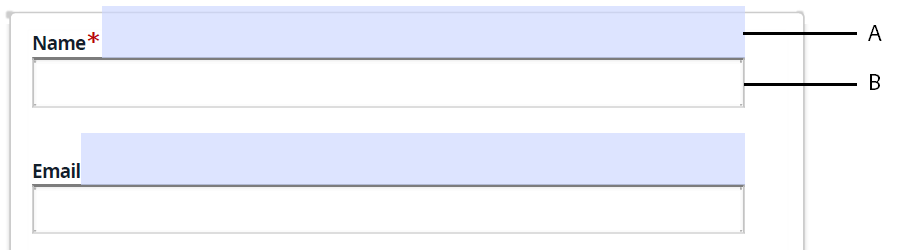

# Problemi noti e limitazioni {#known-issues-limitations}

Prima di iniziare a utilizzare il servizio di Automated forms conversion AEM Forms, esamina i problemi noti e le limitazioni seguenti:

## Problemi noti {#known-issues}

* La cartella contenente i moduli per la conversione non può contenere più di 15 moduli e 50 pagine in totale. Le dimensioni della cartella di origine non devono superare i 10 MB. Non creare sottocartelle nella cartella di origine.
* Alcuni oggetti di forma sono facilmente visibili all&#39;occhio umano, ma [difficile da identificare per il servizio](styles-and-pattern-considerations-and-best-practices.md). Utilizzare [Rivedi e correggi l’editor](review-correct-ui-edited.md) identificare e convertire tali oggetti modulo.
* Editor di revisione e correzione:

   * Nessuna azione di annullamento. Il pulsante Salva salva le modifiche in modo permanente.
   * Non supporta pannelli ripetibili per moduli basati su XFA.
   * Se modificate un elenco in una tabella utilizzando l&#39;editor Revisione e correzione, la larghezza della riga non viene regolata automaticamente e il testo potrebbe fuoriuscire sulla riga successiva della tabella.
   * Il **[!UICONTROL Auto-detect multi-column layout from input forms]** Questa funzione non funziona con l’editor di revisione e correzione e con i frammenti di modulo.
   * La firma scarabocchio creata con l’editor di revisione e correzione non viene caricata per i moduli adattivi pubblicati.

* Per moduli basati su XFA:
   * L’estrazione di frammenti da un modulo basato su XFA non è supportata.
   * Script XFA non supportati. Ad esempio, script per la generazione automatica di valori per un componente del menu a discesa.
   * Il metamodello non funziona per il gruppo di scelta
   * L’opzione Gruppi di scelte con un singolo carattere non è identificata
   * Quando il documento di origine è un XFA (.XDP) dinamico e [definisce il comportamento delle proprietà XFA in un modulo adattivo](https://helpx.adobe.com/experience-manager/6-5/forms/using/xfa-api-supported-in-adaptive-form.html#supportedxfaelementsandtheirmappinginadaptiveformsbr), la proprietà di presenza del documento di origine non viene rispettata. Ad esempio, un campo nel documento di origine è contrassegnato come nascosto e uno script rende visibile il campo, quindi il campo rimane visibile nel modulo adattivo di output.

* Quando si utilizza **Utilizzare AcroForm di input come documento di record (DoR) per i moduli adattivi generati** opzione, considera quanto segue:

<table>
    <tr>
        <td>L'associazione e i dati vengono persi per i campi di testo composito. In un campo di testo composito sono presenti più caselle di testo allineate tra loro. In un AcroForm, ad esempio, il numero di una carta di credito viene suddiviso in più caselle di testo e ogni casella di testo ha un'associazione separata. Quando l’AcroForm viene convertito in modulo adattivo, quest’ultimo presenta un’unica associazione per tutte le caselle di testo. Come soluzione alternativa, prima di convertire un AcroForm in un modulo adattivo, modificare AcroForm in modo che utilizzi una singola casella di testo per accettare i numeri delle carte di credito.</td>
        <td>                                                            </td>
    </tr>
    <tr>
        <td>L’associazione e i dati vengono persi per i campi data compositi. Un campo data composito è composto da tre campi diversi. Ad esempio, un campo data di nascita in un AcroForm viene suddiviso in tre campi separati. Il modulo adattivo fornisce un componente predefinito per la selezione della data. Per utilizzare il componente Selezione data del modulo adattivo mantenendo l’associazione di AcroForm, prima di convertire un AcroForm in modulo adattivo, modifica AcroForm in modo che utilizzi un singolo campo data.</td>
        <td></td>
    </tr>
    <tr>
        <td>Se le dimensioni delle caselle di controllo sono maggiori del testo associato, le caselle di controllo non vengono rilevate e l'associazione nell'AcroForm viene persa. Modificare AcroForm in modo che le dimensioni delle caselle di controllo siano inferiori a quelle del testo associato.</td>
        <td> </td>
    </tr>
    <tr>
        <td>Se i campi di input non sono allineati al campo di testo corrispondente, il campo di input non viene rilevato.  </td>
        <td></td>
    </tr>
    <tr >
        <td>Il servizio converte tutte le caselle di controllo di un AcroForm in gruppi di scelta separati. I gruppi di scelta separati vengono creati per mantenere le associazioni con AcroForm. Non unire gruppi di scelta nel modulo adattivo. Questo comporterà la perdita di binding. Se si uniscono i gruppi di scelta, convertire nuovamente la maschera per recuperare i binding persi. </td>
        <td></td>
    </tr>
    <tr >
        <td>I limiti di alcune tabelle vengono estesi fuori dalla pagina in un documento di record (DoR) generato automaticamente. </td>
        <td></td>
    </tr>
</table>

## Limitazioni {#limitations}

* I PDF forms con layout dinamico complesso, i campi con contorno punteggiato o i campi riempiti non sono supportati.
* Le immagini e il testo all’interno delle immagini non vengono identificati. Aggiungere manualmente le immagini ai moduli convertiti.
* I documenti XDP della grafica non sono supportati.
* I PDF forms di dimensioni superiori a 15 pagine non sono supportati.
* I documenti crittografati, protetti da password e protetti non vengono convertiti. Rimuovere la crittografia o le password prima di eseguire la conversione.
* Le tabelle complesse come tabelle senza bordi, tabelle nidificate e tabelle con valori segnaposto non sono supportate. Utilizza l’editor di moduli adattivi per aggiungere o modificare tabelle complesse dopo la conversione. Sono supportate solo tabelle semplici, con campi vuoti, intestazioni corrette e limiti chiari.
* Il servizio converte in moduli adattivi solo i moduli in lingua inglese, francese, tedesca, spagnola, italiana e portoghese. È possibile tradurre i moduli adattivi convertiti in un’altra lingua utilizzando [Flusso di lavoro di traduzione AEM](https://helpx.adobe.com/it/experience-manager/6-5/forms/using/using-aem-translation-workflow-to-localize-adaptive-forms.html).
* AEM 6.4 Forms non supporta il rilevamento automatico del layout a più colonne dei moduli di input.
* Le informazioni codificate utilizzando i colori nel modulo PDF di origine non vengono trasferite al modulo adattivo.
* I colori del modulo PDF di origine non vengono trasferiti ai temi dei moduli adattivi.
* I PDF forms colorati vengono trattati come forme in scala di grigio e i campi vengono rilevati di conseguenza.
