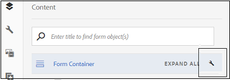

# Workflow di preriempimento basato su origine di dati e invio consigliati per i moduli adattivi {#recommended-data-source-btased-prefill-and-submit-workflows-for-adaptive-forms}

Con i moduli adattivi convertiti tramite il servizio di Automated forms conversion è possibile utilizzare una delle seguenti origini dati:

* Modello dati modulo, OData o qualsiasi altro servizio di terze parti
* Schema JSON
* Schema XSD

In base all’origine dati, puoi scegliere di generare un modulo adattivo con o senza un modello di dati.

Questo articolo descrive i flussi di lavoro consigliati per precompilare i valori dei campi e le opzioni di invio dopo aver selezionato un’origine dati e generato un modulo adattivo utilizzando il servizio di conversione.

<table> 
 <tbody> 
  <tr> 
   <th><strong>Sorgente dati</strong></th> 
   <th><strong>Workflow consigliato</strong></th> 
  </tr> 
  <tr> 
   <td><p>Modello dati modulo, OData o qualsiasi altro servizio di terze parti</p></td> 
   <td> 
    <p><strong>Opzione 1</strong>: seleziona come origine dati modello dati modulo, OData o qualsiasi altro servizio di terze parti. Tu <a href="#generate-adaptive-forms-with-no-data-binding">genera un modulo adattivo senza associazione dati</a> utilizzo del servizio di Automated forms conversion. I campi del modulo adattivo vengono associati manualmente alle entità del modello dati del modulo e per precompilare i valori dei campi viene utilizzata l’opzione Servizio di precompilazione modello dati modulo. Per inviare il modulo adattivo, utilizza l’opzione Invia utilizzando il modello dati del modulo.</p></td> 
  </tr>
  <tr> 
   <td></td> 
   <td> 
   <p><strong>Opzione 2</strong>: seleziona come origine dati modello dati modulo, OData o qualsiasi altro servizio di terze parti. Tu <a href="#generate-adaptive-forms-with-no-data-binding">genera un modulo adattivo senza associazione dati</a> utilizzo del servizio di Automated forms conversion. Per precompilare i valori dei campi, associa i campi del modulo adattivo utilizzando l’editor di regole. Se necessario, modifica i valori dei campi e invia i dati all’archivio crx.</p>
    </td> 
  </tr>
  <tr> 
   <td></td> 
   <td> 
    <p>Per istruzioni dettagliate sull’esecuzione di questi flussi di lavoro, consulta <a href="#sqldatasource">Utilizzare database, OData o qualsiasi servizio di terze parti come origine dati.</a></p> </td> 
  </tr>
  <tr>
  <td><p>Schema JSON</p></td> 
   <td> 
    <p>Seleziona lo schema JSON come origine di dati. In base all'origine dati selezionata:</p></td> 
  </tr>
  <tr>
  <td></td> 
   <td> 
    <p><strong>Opzione 1</strong>: tu <a href="#generate-adaptive-forms-with-no-data-binding">genera un modulo adattivo senza associazione dati</a> utilizzando il servizio di Automated forms conversion e configurando lo schema JSON come origine di dati. I campi del modulo adattivo vengono associati manualmente allo schema JSON e <a href="https://helpx.adobe.com/experience-manager/6-5/forms/using/prepopulate-adaptive-form-fields.html#Supportedprotocolsforprefillinguserdata" target="_blank">utilizza uno dei protocolli supportati</a> per precompilare i valori dei campi. Se necessario, modifica i valori dei campi e invia i dati all’archivio crx.</p></td> 
  </tr>
  <tr>
  <td></td> 
   <td> 
    <p>Per istruzioni dettagliate sull’esecuzione dei flussi di lavoro, consulta <a href="#jsondatasource">Utilizza lo schema JSON come origine di dati.</p></td> 
  </tr>
  <tr>
  <td></td> 
   <td> 
    <p><strong>Opzione 2</strong>: tu <a href="#generate-adaptive-forms-with-json-binding">generare un modulo adattivo con associazione dati JSON</a> utilizzo del servizio di Automated forms conversion. Il servizio di precompilazione e l’invio dei moduli funzionano senza problemi. Non è necessario alcun passaggio di configurazione.</p> </td> 
  </tr>
   <tr>
  <td></td> 
   <td> 
    <p>Per istruzioni dettagliate sull’esecuzione dei flussi di lavoro, consulta <a href="#jsonwithdatabinding">Utilizza lo schema JSON come origine di dati.</a></p> </td> 
  </tr>
  <tr>
  <td><p>Schema XSD</p></td> 
   <td> 
    <p>Seleziona lo schema XSD come origine dati. In base all'origine dati selezionata, <a href="#generate-adaptive-forms-with-no-data-binding">genera un modulo adattivo senza associazione dati</a> utilizzando il servizio di Automated forms conversion e configurando lo schema XSD come origine di dati. I campi del modulo adattivo vengono associati manualmente allo schema XSD e <a href="https://helpx.adobe.com/experience-manager/6-5/forms/using/prepopulate-adaptive-form-fields.html#Supportedprotocolsforprefillinguserdata" target="_blank">utilizza uno dei protocolli supportati</a> per precompilare i valori dei campi. Se necessario, modifica i valori dei campi e invia i dati all’archivio crx.</p>
    </td> 
  </tr>
  <tr>
  <td></td> 
   <td> 
    <p>Per istruzioni dettagliate sull’esecuzione dei flussi di lavoro, consulta <a href="#xsddatasource">Utilizza lo schema XSD come origine di dati.</a></p>
    </td> 
  </tr>
 </tbody> 
</table>


Per ulteriori informazioni sul servizio di Automated forms conversion, vedere gli articoli seguenti:

* [Introduzione al servizio di conversione automatica dei moduli](introduction.md)
* [Configurazione del servizio di conversione automatica dei moduli](configure-service.md)
* [Conversione di moduli per la stampa in moduli adattivi](convert-existing-forms-to-adaptive-forms.md)
* [Revisione dei moduli convertiti](review-correct-ui-edited.md)

Le informazioni fornite in questo articolo si basano sul presupposto che chiunque le legga abbia una conoscenza di base dei concetti dei moduli adattivi.

## Prerequisiti {#pre-requisites}

* Configurare un [Istanza di authoring AEM](https://helpx.adobe.com/it/experience-manager/6-5/sites/deploying/using/deploy.html)
* Configura [Servizio di automated forms conversion nell’istanza di authoring AEM](configure-service.md)

## Modulo adattivo di esempio {#sample-adaptive-form}

Per eseguire i casi d’uso per precompilare i valori dei campi in un modulo adattivo e inviarli all’origine dati, scarica il seguente file PDF di esempio.

Modulo di richiesta di prestito di esempio

[Ottieni file](assets/sample_loan_application_form.pdf)

Il file PDF funge da input per il servizio di Automated forms conversion. Il servizio converte questo file in un modulo adattivo. L’immagine seguente illustra l’esempio di richiesta di prestito in formato PDF.


## Prepara dati per modello modulo {#prepare-data-for-form-model}

L’integrazione dei dati di AEM Forms consente di configurare e connettersi a diverse origini dati. Dopo aver generato un modulo adattivo utilizzando il processo di conversione, puoi definire il modello del modulo in base a un modello di dati del modulo, XSD o uno schema JSON. È possibile utilizzare un database, Microsoft Dynamics o qualsiasi altro servizio di terze parti per creare un modello di dati modulo.

Questa esercitazione utilizza il database MySQL come origine per la creazione di un modello di dati modulo. Creare un **richiesta di prestito** nel database e aggiungi un **richiedente** nello schema in base ai campi disponibili nel modulo adattivo.


È possibile utilizzare la seguente istruzione DDL per creare **richiedente** tabella nel database.

```sql
CREATE TABLE `applicant` (
   `name` varchar(45) DEFAULT NULL,
   `address` varchar(45) DEFAULT NULL,
   `phonenumber` int(11) NOT NULL,
   `email` varchar(45) DEFAULT NULL,
   `occupation` varchar(45) DEFAULT NULL,
   `annualsalary` varchar(45) DEFAULT NULL,
   `familymembers` int(11) DEFAULT NULL,
   PRIMARY KEY (`phonenumber`)
 ) ENGINE=InnoDB DEFAULT CHARSET=utf8
```

Se utilizzi uno schema XSD come modello del modulo per eseguire i casi d’uso, crea un file XSD con il testo seguente:

```xml
<?xml version="1.0" encoding="utf-8" ?>
    <xs:schema targetNamespace="http://adobe.com/sample.xsd"
                    xmlns="http://adobe.com/sample.xsd"
                    xmlns:xs="http://www.w3.org/2001/XMLSchema">

<xs:element name="sample" type="SampleType"/>

  <xs:complexType name="SampleType">
    <xs:sequence>
      <xs:element name="name" type="xs:string"/>
   <xs:element name="address" type="xs:string"/>
   <xs:element name="phonenumber" type="xs:int"/>
   <xs:element name="email" type="xs:string"/>
   <xs:element name="occupation" type="xs:string"/>
   <xs:element name="annualsalary" type="xs:string"/>
   <xs:element name="familymembers" type="xs:string"/>
 </xs:sequence>
  </xs:complexType>

  </xs:schema>
```

Oppure scarica lo schema XSD nel file system locale.

Esempio di schema XSD per la richiesta di prestito

[Ottieni file](assets/loanapplication.xsd)

Per ulteriori informazioni sull’utilizzo dello schema XSD come modello di modulo nei moduli adattivi, consulta [Creazione di moduli adattivi tramite schema XML](https://helpx.adobe.com/experience-manager/6-5/forms/using/adaptive-form-xml-schema-form-model.html).

Se utilizzi uno schema JSON come modello del modulo per eseguire i casi d’uso, crea un file JSON con il testo seguente:

```JSON
{
    "$schema": "http://json-schema.org/draft-04/schema#",
    "definitions": {
        "loanapplication": {
            "type": "object",
            "properties": {
                "name": {
                    "type": "string"
                },
                "address": {
                    "type": "string"
                },
    "phonenumber": {
                    "type": "number"
                },
    "email": {
                    "type": "string"
                },
    "occupation": {
                    "type": "string"
                },
    "annualsalary": {
                    "type": "string"
                },
    "familymembers": {
                    "type": "number"
                }
            }
        }
 },
 "type": "object",
    "properties": {
        "employee": {
            "$ref": "#/definitions/loanapplication"
        }
    }
}
```

In alternativa, scarica lo schema JSON nel file system locale.

Esempio di schema JSON per richiesta di prestito

[Ottieni file](assets/demo_schema.json)

Per ulteriori informazioni sull’utilizzo dello schema JSON come modello di modulo nei moduli adattivi, consulta [Creazione di moduli adattivi tramite schema JSON](https://helpx.adobe.com/experience-manager/6-5/forms/using/adaptive-form-json-schema-form-model.html).

## Generare moduli adattivi senza associazione dati {#generate-adaptive-forms-with-no-data-binding}

Utilizza il [Servizio automated forms conversion da convertire](convert-existing-forms-to-adaptive-forms.md) il [modulo di richiesta di prestito di esempio](#sample-adaptive-form) in un modulo adattivo senza associazione di dati. Accertati di selezionare **[!UICONTROL Generate adaptive form(s) without data bindings]** per generare il modulo adattivo senza associazione dati.


Dopo aver generato un modulo adattivo senza alcuna associazione di dati, seleziona un’origine dati per il modulo adattivo:

* [Database, OData o qualsiasi servizio di terze parti](#sqldatasource)
* [Schema JSON](#jsondatasource)
* [Schema XSD](#xsddatasource)

>[!NOTE]
> Se il modulo adattivo convertito con il servizio di Automated forms conversion contiene più campi con lo stesso nome, assicurati che siano associati alle entità dell’origine dati per evitare una possibile perdita di dati durante l’invio.
>

### Utilizza database, OData o qualsiasi servizio di terze parti come origine dati {#sqldatasource}

Caso d’uso: viene generato un modulo adattivo senza associazione di dati utilizzando il servizio di Automated forms conversion e viene configurato il database MYSQL come origine dati. I campi del modulo adattivo vengono associati manualmente alle entità del modello dati del modulo e vengono utilizzati **[!UICONTROL Form Data Model Prefill Service]** per precompilare i valori dei campi. Utilizzi il **[!UICONTROL Submit using Form Data Model]** per inviare il modulo adattivo.

Prima di eseguire il caso d’uso:

* [Configurare il database MySQL come origine dati](https://helpx.adobe.com/experience-manager/6-5/forms/using/configure-data-sources.html#configurerelationaldatabase)
* [Creare il modello dati del modulo](https://helpx.adobe.com/experience-manager/6-5/forms/using/work-with-form-data-model.html)

In base al caso d’uso, crea il **richiesta di prestito** modello dati modulo e associazione argomento servizio lettura a un **[!UICONTROL Literal]** valore. Il valore letterale del numero di telefono deve essere di uno dei record configurati in **richiedente** schema del database MySQL. I servizi utilizzano il valore come argomento per recuperare i dettagli dall’origine dati. Puoi anche selezionare [Attributo profilo utente o Attributo richiesta](https://helpx.adobe.com/experience-manager/6-5/forms/using/work-with-form-data-model.html#bindargument) dal **[!UICONTROL Binding To]** elenco a discesa


>[!NOTE]
>
>Assicurati di aggiungere **ottenere** e **inserire** servizi al modello di dati del modulo, configurare e testare i servizi prima di eseguire il caso d’uso.

Esegui i seguenti passaggi:

1. Seleziona il file convertito **modulo di richiesta di prestito di esempio** disponibile in **[!UICONTROL output]** cartella e tocca **[!UICONTROL Properties]**.
1. Tocca il **[!UICONTROL Form Model]** , seleziona **[!UICONTROL Form Data Model]** dal **[!UICONTROL Select From]** e tocca **[!UICONTROL Select Form Data Model]** per selezionare **richiesta di prestito** modello dati modulo. Tocca **[!UICONTROL Save & Close]** per salvare il modulo.
1. Seleziona la **modulo di richiesta di prestito di esempio** e tocca **[!UICONTROL Edit]**.
1. In **[!UICONTROL Content]** , tocca l’icona configura:

   

   1. In **[!UICONTROL Basic]** sezione, seleziona **[!UICONTROL Form Data Model Prefill service]** dal **[!UICONTROL Prefill Service]** elenco a discesa.

   1. In **[!UICONTROL Submission]** sezione, seleziona **[!UICONTROL Submit using Form Data Model]** dal **[!UICONTROL Submit Action]** elenco a discesa.

   1. Seleziona il modello dati utilizzando **[!UICONTROL Data Model to submit]** campo.
   1. Tocca  per salvare le proprietà.

1. Toccare la casella di testo Nome candidato e selezionare  (Configura).

   1. Nel campo Associa riferimento, seleziona **Richiedente** > **Nome**, e tocca  per salvare le proprietà. Analogamente, creare un&#39;associazione dati per **Indirizzo**, **Numero di telefono**, **E-mail**, **Occupazione**, **Stipendio annuale (in dollari)**, e **No. di familiari a carico** campi con le entità del modello dati del modulo.

   

1. Tocca **[!UICONTROL Preview]** per visualizzare i valori dei campi del modulo adattivo precompilati.
1. Se necessario, modifica i valori dei campi e invia il modulo adattivo. I valori dei campi vengono inviati al database MySQL. È possibile aggiornare **richiedente** per visualizzare i valori aggiornati nella tabella.

**Caso d’uso:** Viene generato un modulo adattivo senza associazione dati utilizzando il servizio di Automated forms conversion e viene configurato il database MYSQL come origine dati. Per precompilare i valori dei campi, associa i campi del modulo adattivo utilizzando l’editor di regole. Se necessario, modifica i valori dei campi e invia i dati all’archivio crx.

Esegui i seguenti passaggi per utilizzare [editor di regole](https://helpx.adobe.com/experience-manager/6-5/forms/using/rule-editor.html) per richiamare il servizio modello dati modulo per associare campi e valori di precompilazione in un modulo adattivo:

1. Seleziona la **modulo di richiesta di prestito di esempio** nel **[!UICONTROL output]** cartella e tocca **[!UICONTROL Edit]**.
1. In **[!UICONTROL Content]** , tocca l’icona configura:

   

   In **[!UICONTROL Basic]** sezione, seleziona **[!UICONTROL Form Data Model Prefill service]** dal **[!UICONTROL Prefill Service]** elenco a discesa.

1. Tocca il **[!UICONTROL Applicant Name]** casella di testo e tocca **[!UICONTROL Edit Rules]**.

   

1. Tocca **[!UICONTROL Create]** nella pagina Editor di regole.
1. Il giorno **[!UICONTROL Rule Editor]** pagina:

   1. Selezionare uno stato per la casella di testo Nome candidato. Ad esempio: **[!UICONTROL is initialized]**, che si traduce nell&#39;esecuzione del **[!UICONTROL Then]** condizione durante il rendering del modulo in **[!UICONTROL Preview]** modalità.

   1. In **[!UICONTROL Then]** sezione, seleziona **[!UICONTROL Invoke Service]** dal **[!UICONTROL Select Action]** elenco a discesa. Tutti i servizi nell’istanza Forms vengono visualizzati nell’elenco a discesa.

   1. Seleziona un **[!UICONTROL Get]** dalla sezione in cui sono elencati i modelli di dati del modulo. Viene visualizzato il campo Input **numero di telefono**, che è la chiave primaria definita per **richiedente** modello dati. Il sistema recupera e compila i valori nel modulo adattivo per i campi della sezione Output in base a questo campo.

   1. Crea un’associazione per i campi del modulo adattivo con le entità del modello dati del modulo utilizzando la sezione Output. Ad esempio, binding **[!UICONTROL Applicant Name]** campo modulo adattivo con **nome** entità.

   1. Tocca **[!UICONTROL Done]**. Tocca **[!UICONTROL Done]** nuovamente nella pagina Editor regole.

   

1. Tocca **[!UICONTROL Preview]** per visualizzare i valori dei campi del modulo adattivo precompilati.

   >[!NOTE]
   >
   >Assicurati che **[!UICONTROL Return Array]** La proprietà è impostata su OFF per **ottenere** proprietà del servizio nel modello dati del modulo associato al modulo adattivo.

1. Se necessario, modifica i valori dei campi e invia il modulo adattivo. I dati inviati sono disponibili nella seguente posizione nell’archivio crx:

   `http://host name:port/crx/de/index.jsp#/content/forms/fp/admin/submit/data/latest file available in the folder`

### Utilizza lo schema JSON come origine di dati {#jsondatasource}

**Caso d’uso:** Puoi generare un modulo adattivo senza associazione dati utilizzando il servizio di Automated forms conversion e configurare lo schema JSON come origine dati. I campi del modulo adattivo vengono associati manualmente allo schema JSON e viene utilizzato il **Anteprima con i dati** per precompilare i valori dei campi. Se necessario, modifica i valori dei campi e invia i dati all’archivio crx.

Prima di eseguire il caso d’uso, assicurati di disporre di:

* [uno schema JSON valido conforme alla struttura dello schema JSON](#prepare-data-for-form-model)
* [un modulo adattivo senza associazione di dati](#generate-adaptive-forms-with-no-data-binding)

Esegui i seguenti passaggi:

1. Seleziona il file convertito **modulo di richiesta di prestito di esempio** disponibile in **output** cartella e tocca **[!UICONTROL Properties]**.
1. Tocca il **[!UICONTROL Form Model]** , seleziona **[!UICONTROL Schema]** dal **[!UICONTROL Select From]** e tocca **[!UICONTROL Select Schema]** per caricare **JSON demo.schema** schema salvato nel file system locale. Tocca **[!UICONTROL Save & Close]** per salvare il modulo.
1. Seleziona la **modulo di richiesta di prestito di esempio** e tocca **[!UICONTROL Edit]**.
1. Toccare la casella di testo Nome candidato e selezionare  (Configura).

   Nel campo Associa riferimento, seleziona **Richiedente** > **Nome**, e tocca  per salvare le proprietà. Analogamente, creare un&#39;associazione dati per **Indirizzo**, **Numero di telefono**, **E-mail**, **Occupazione**, **Stipendio annuale (in dollari)**, e **No. di familiari a carico** con le entità dello schema JSON.

1. Seleziona il file convertito **modulo di richiesta di prestito di esempio** disponibile in **[!UICONTROL output]** cartella di nuovo e seleziona **[!UICONTROL Preview]** > **[!UICONTROL Preview with Data]**.</br>

   Scarica file di dati di esempio</br>

   [Ottieni file](assets/json_data_file.txt)</br>

1. Se necessario, modifica i valori dei campi e invia il modulo adattivo. I dati inviati sono disponibili nella seguente posizione nell’archivio crx:

   `http://host name:port/crx/de/index.jsp#/content/forms/fp/admin/submit/data/latest file available in the folder`

### Utilizza lo schema XSD come origine di dati {#xsddatasource}

**Caso d’uso:** Puoi generare un modulo adattivo senza associazione dati utilizzando il servizio di Automated forms conversion e configurare lo schema XSD come origine dati. Associare manualmente i campi del modulo adattivo allo schema XSD e utilizzare **Anteprima con i dati** per precompilare i valori dei campi. Se necessario, modifica i valori dei campi e invia i dati all’archivio crx.

Prima di eseguire il caso d’uso, assicurati di disporre di:

* [uno schema XSD valido conforme alla struttura dello schema XML](#prepare-data-for-form-model)
* [un modulo adattivo senza associazione di dati](#generate-adaptive-forms-with-no-data-binding)

Esegui i seguenti passaggi:

1. Seleziona il file convertito **modulo di richiesta di prestito di esempio** disponibile in **[!UICONTROL output]** cartella e tocca **[!UICONTROL Properties]**.
1. Tocca il **[!UICONTROL Form Model]** , seleziona **[!UICONTROL Schema]** dal **[!UICONTROL Select From]** e tocca **[!UICONTROL Select Schema]** per caricare **richiesta di prestito** Schema XSD salvato nel file system locale. Seleziona l’elemento principale per lo schema XSD e tocca **[!UICONTROL Save & Close]** per salvare il modulo.
1. Seleziona la **modulo di richiesta di prestito di esempio** e tocca **[!UICONTROL Edit]**.
1. Toccare la casella di testo Nome candidato e selezionare  (Configura).
Nel campo Associa riferimento, seleziona **Richiedente** > **Nome**, e tocca  per salvare le proprietà. Analogamente, creare un&#39;associazione dati per **Indirizzo**, **Numero di telefono**, **E-mail**, **Occupazione**, **Stipendio annuale (in dollari)**, e **No. di familiari a carico** con le entità dello schema XSD.

1. Seleziona il file convertito **modulo di richiesta di prestito di esempio** disponibile in **output** cartella di nuovo e seleziona **[!UICONTROL Preview]** > **[!UICONTROL Preview with Data]**.</br>

   Scarica file di dati di esempio</br>

   [Ottieni file](assets/loan-application-data-xml-data.zip)</br>


1. Se necessario, modifica i valori dei campi e invia il modulo adattivo. I dati inviati sono disponibili nella seguente posizione nell’archivio crx:

   `http://host name:port/crx/de/index.jsp#/content/forms/fp/admin/submit/data/latest file available in the folder`

## Generare moduli adattivi con binding JSON {#generate-adaptive-forms-with-json-binding}

Utilizza il [Servizio automated forms conversion da convertire](convert-existing-forms-to-adaptive-forms.md) il [modulo di richiesta di prestito di esempio](#sample-adaptive-form) in un modulo adattivo con associazione dati. Assicurati di non selezionare **[!UICONTROL Generate adaptive form(s) without data bindings]** durante la generazione del modulo adattivo.


### Utilizza lo schema JSON come origine di dati {#jsonwithdatabinding}

**Caso d’uso:** Puoi generare un modulo adattivo con associazione dati JSON utilizzando il servizio di Automated forms conversion. Il servizio di precompilazione e l’invio dei moduli funzionano senza problemi. Non è necessario alcun passaggio di configurazione.

Prima di eseguire il caso d’uso, assicurati di avere [un modulo adattivo con associazione dati](#generate-adaptive-forms-with-json-binding).

Esegui i seguenti passaggi:

1. Seleziona il file convertito **modulo di richiesta di prestito di esempio** disponibile in **[!UICONTROL output]** cartella di nuovo e seleziona **[!UICONTROL Preview]** > **[!UICONTROL Preview with Data]**.</br>

   Scarica file di dati di esempio</br>

   [Ottieni file](assets/loan_application_data_source_json_data_binding.txt)</br>

1. Se necessario, modifica i valori dei campi e invia il modulo adattivo. I dati inviati sono disponibili nella seguente posizione nell’archivio crx:

   `http://host name:port/crx/de/index.jsp#/content/forms/fp/admin/submit/data/latest file available in the folder`

## Conversione dei dati JSON del modulo adattivo inviati in formato XML {#convert-submitted-adaptive-form-data-to-xml}

Quando immetti i valori nei campi del modulo adattivo e li invii, i dati sono disponibili in formato JSON nell’archivio crx. È possibile convertire il formato dei dati JSON in XML utilizzando [org.apache.sling.commons.json.xml](https://sling.apache.org/apidocs/sling5/org/apache/sling/commons/json/xml/XML.html#toString) API o il seguente codice di esempio:

```
import org.apache.sling.commons.json.JSONException;
import org.apache.sling.commons.json.JSONObject;
import org.apache.sling.commons.json.xml.XML;
 
public class ConversionUtils {
 
    public static String jsonToXML(String jsonString) throws JSONException {
        //https://sling.apache.org/apidocs/sling5/org/apache/sling/commons/json/xml/XML.html#toString(java.lang.Object)
        //jar - http://maven.ibiblio.org/maven2/org/apache/sling/org.apache.sling.commons.json/2.0.18/
        //Note: Need to extract boundData part before converting to XML
        return XML.toString(new JSONObject(jsonString));
    }
}
```
