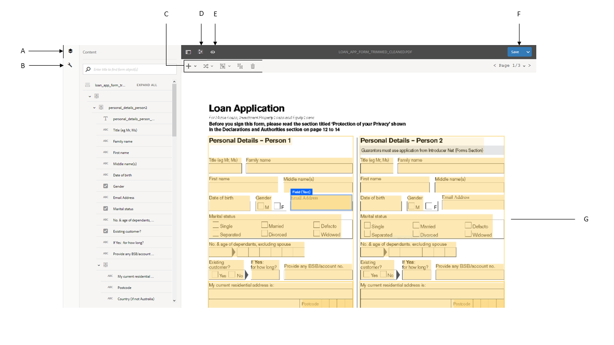
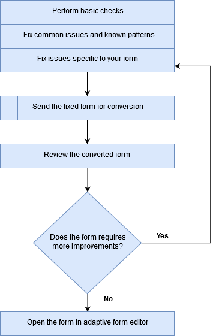
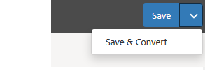

# Revisione dei moduli convertiti{#review-and-correct-converted-forms}

Il servizio di Automated forms conversion AEM Forms identifica campi, contenuto e layout del documento di input PDF e converte il documento di input PDF in un modulo adattivo. Il modulo adattivo di output può contenere alcuni campi mancanti o convertiti in modo errato. Puoi utilizzare l’editor di revisione e correzione per apportare miglioramenti ai campi identificati e rigenerare il modulo adattivo per avvicinare l’output all’esperienza desiderata. Dopo la prima conversione, puoi aprire il documento PDF di input nell’editor per:

* Visualizza tutti i campi e i contenuti identificati durante la conversione
* Identifica i campi e il contenuto mancanti durante la conversione
* Verifica il tipo di un campo e modificane il tipo, se necessario
* Verificare le tabelle identificate, ridimensionare le colonne e modificare il contenuto delle celle
* Rimuovi i campi identificati erroneamente

Dopo aver apportato le modifiche necessarie, invia nuovamente i PDF forms al servizio di conversione. In caso di conversione corretta, le risorse aggiornate, inclusi il modulo adattivo e lo schema, vengono scaricate nell’istanza di AEM Forms. Puoi ripetere la procedura fino a ottenere l’esperienza desiderata. 

È necessario Google Chrome, Mozilla FireFox o Microsoft Edge browser per utilizzare la revisione e l’editor corretto. L&#39;editor non supporta Internet Explorer.

## Editor di revisione e correzione {#welcome-to-review-and-correct-editor}

L’editor di revisione e correzione fornisce un’interfaccia di facile utilizzo. Ha i seguenti componenti:

* Browser contenuto: puoi utilizzare il browser contenuto per modificare la posizione di un elemento. Il browser Contenuto consente di trascinare un oggetto modulo per modificarne la posizione. Ad esempio, spostando una tabella prima di una casella di testo. Modifica di conseguenza l’ordine di tabulazione del modulo adattivo generato.
* Browser Proprietà: visualizza le proprietà di un campo selezionato. Puoi anche modificare le proprietà.
* Barra degli strumenti: la barra degli strumenti si trova nella parte superiore dell’editor. Vengono visualizzati gli strumenti per aggiungere, modificare, raggruppare, separare ed eliminare campi.
* Apri proprietà: quando tocca il pulsante  icona. È possibile fare clic su apri proprietà per aprire le proprietà della maschera e visualizzare ulteriori opzioni.
* Pulsante Filtro: pulsante Filtro  è nella parte superiore dell’editor. Consente di filtrare i campi in modo da visualizzare solo testi, campi, gruppi di scelta, pannelli o tutti i componenti.
* Pulsante Salva: **[!UICONTROL Save]** si trova nell’angolo superiore destro dell’editor. È inoltre possibile utilizzare la freccia accanto al pulsante Salva per visualizzare l&#39;opzione che consente di inviare il modulo per la conversione.

* Modulo PDF: l’editor visualizza il documento PDF di origine e lo sovrappone con i campi identificati. Per modificare i campi, puoi utilizzare gli strumenti della barra degli strumenti.
* Pagine: un modulo di origine può avere più pagine. L’editor fornisce un pulsante nell’angolo superiore destro per spostarsi tra le pagine.

**R.** Browser contenuti **B.** Browser Proprietà **C.** Barra degli strumenti **D.** Pulsante Proprietà **E.** Pulsante Filtro **F.** Pulsante Salva **G.** Modulo PDF sovrapposto a campi identificati

Dopo la prima conversione riuscita, il servizio di conversione sovrappone il documento PDF di origine con i campi e i componenti identificati. Questi campi o componenti sono di tipo Testo, Campo, Pannello, Gruppo di scelte e Tabella:

* Testo: testo normale nel documento PDF di origine. Ad esempio, il testo della richiesta di prestito nell’immagine mostrata sopra.
* Campo: combinazione di testo o etichetta di icona associata a un valore o a una casella di input. Ad esempio, il nome del primo campo nell’immagine precedente. Include un&#39;etichetta di testo e una casella di input. Un campo supporta tipi di dati di tipo testo, numerico, a discesa, data, e-mail, numero di telefono, firma, valuta e password.
* Pannello: raccolta logica di contenuti e componenti. Ad esempio, i dettagli personali dei pannelli Persona 1 e Persona 2 nell’immagine precedente.
* Gruppo di scelta: combinazione di testo associata a più opzioni di scelta: casella di controllo e pulsante di scelta. Ad esempio, stato civile e cliente esistente nell’immagine precedente.\
  In base alla didascalia del gruppo di scelta e alle opzioni a scelta multipla, il servizio di conversione converte automaticamente un gruppo di scelta in un pulsante di scelta a selezione singola o in una casella di controllo a selezione multipla. Ad esempio, se è presente **Selezionane una** poiché la didascalia del gruppo di scelta o le opzioni a scelta multipla consentono di selezionare una sola opzione, **Sì** o **No**, il servizio di conversione converte automaticamente il gruppo di scelta in un pulsante di scelta a selezione singola. Analogamente, se è presente **Seleziona tutte le opzioni applicabili** o **Seleziona più** poiché la didascalia del gruppo di scelta o le opzioni a scelta multipla consentono di selezionare più opzioni, il servizio di conversione converte automaticamente il gruppo di scelta in una casella di controllo a selezione multipla.

* Tabella: una tabella 2d con informazioni rappresentate in colonne e righe. È possibile aggiungere o rimuovere righe o colonne in una tabella.

## Inizia a rivedere una conversione {#start-reviewing-a-conversion}

Dopo la prima conversione riuscita, il servizio di conversione sovrappone il documento PDF di origine con i campi e i componenti identificati. Puoi apportare miglioramenti ai campi identificati e rigenerare il modulo adattivo per avvicinare l’output all’esperienza desiderata. Puoi iniziare a rivedere una conversione solo dopo la prima conversione riuscita.

### Prima di iniziare {#before-you-start}

* L’editor di revisione e correzione non supporta i frammenti. Non utilizzare l’editor per rivedere le conversioni con **Estrai frammento** opzione attivata durante le conversioni. È possibile utilizzare [editor di moduli adattivi](https://helpx.adobe.com/experience-manager/6-5/forms/using/introduction-forms-authoring.html) per tali conversioni.

* L’editor di revisione e correzione non dispone dell’azione di annullamento. Utilizza il pulsante Salva solo per salvare in modo permanente le modifiche.

### Avvia la revisione {#start-the-review}

Per iniziare a esaminare le conversioni, seleziona il documento PDF di origine utilizzato per la conversione e tocca **Verifica conversioni**. L’editor di revisione e correzione si apre in una nuova scheda. Puoi iniziare a esaminare le conversioni. Esegui i seguenti controlli di base prima di iniziare a risolvere qualsiasi altro problema:

1. **Tipo di controllo di tutti i campi**: il servizio di conversione può assegnare un tipo errato a un campo. Ad esempio, al campo del telefono cellulare viene assegnato il testo digitato anziché il telefono. Puoi passare il cursore del mouse su un campo per trovare il tipo di campo.

   Per modificare il tipo di un campo, selezionalo, apri il browser delle proprietà, quindi seleziona un valore da **[!UICONTROL Type]** a discesa e tocca **[!UICONTROL Save]**. Il tipo viene modificato.

   

1. **Rimuovere i pannelli aggiuntivi**: il servizio di conversione può generare pannelli aggiuntivi. Ad esempio, nel pannello principale è incluso un pannello secondario aggiuntivo, lo spazio vuoto viene convertito in un pannello e una casella di controllo in un pannello. Rivedi i limiti di tutti i pannelli e rimuovi i pannelli aggiuntivi. Puoi utilizzare il filtro  per visualizzare tutti i pannelli.

   È possibile eliminare o separare un pannello per rimuoverlo. Quando si utilizza l’opzione Elimina, vengono eliminati anche i campi o i componenti secondari del pannello:

   * Per eliminare un pannello, selezionalo e tocca Elimina  nella barra degli strumenti. Nella finestra di dialogo di conferma, tocca **[!UICONTROL Confirm]**. Tocca **[!UICONTROL Save]** per salvare le modifiche.

   * Per separare un pannello, selezionalo e tocca l’icona Separa nella barra degli strumenti. Il pannello è separato e i campi secondari del pannello separato vengono regolati sul campo principale. Tocca **[!UICONTROL Save]**per salvare le modifiche.

1. **Creare gruppi logici di testo**: verifica la completezza e la correttezza dei testi identificati. Inoltre, verificate che i testi siano posizionati in modo logico in pannelli o gruppi corretti. Ad esempio, in un layout a più colonne, i testi di un gruppo logico e inseriti in un altro gruppo.

   * Per verificare la completezza e la correttezza del testo, utilizza il filtro  per visualizzare solo il testo, fare clic su ogni testo e confermare. Correggi eventuali problemi di ortografia, battitura o grammatica.

   * Per aggiungere testo al modulo, tocca il pulsante +, quindi tocca **[!UICONTROL Text]**. Disegnare la casella, aprire il browser delle proprietà e digitare il testo da aggiungere alla casella Contenuto.

1. **Tabelle di revisione:** Assicurarsi che tutti i bordi della tabella siano identificati. Inoltre, assicurati che il contenuto delle celle sia identificato correttamente.

   * Per identificare i bordi mancanti, utilizzare **[!UICONTROL Add Column]** o **[!UICONTROL Add Row]** opzione.

   * Per rimuovere bordi aggiuntivi, utilizzare **[!UICONTROL Delete Column]** o **[!UICONTROL Delete Row]** opzione.

Dopo aver apportato le modifiche necessarie, tocca il **[!UICONTROL Save & Convert]** per inviare di nuovo i PDF forms al servizio di conversione. Ogni campo viene convertito nel componente di un campo adattivo corrispondente. Dopo la conversione, le risorse aggiornate, inclusi il modulo adattivo e lo schema, vengono scaricate nell’istanza di AEM Forms. A seconda della complessità del modulo, il servizio può richiedere un po’ di tempo per completare la conversione.

Dopo aver eseguito i controlli di base, è possibile esaminare il modulo per risolvere i problemi specifici dell&#39;organizzazione. Questi problemi possono essere correlati all’aggiunta di campi mancanti e altro ancora. È possibile visualizzare [Utilizzare gli strumenti di revisione e correzione dell’editor](review-correct-ui-edited.md#use-the-review-and-correct-editor-tools) per informazioni su tutti gli strumenti forniti dall’editor per risolvere tali problemi.

È inoltre possibile lavorare per riconoscere problemi identici che si verificano in quasi tutte le maschere e segnalare tali modelli ad Adobe. Utilizza l’editor di revisione e correzione fino a ottenere l’esperienza desiderata.

## Utilizzare gli strumenti di revisione e correzione dell’editor {#use-the-review-and-correct-editor-tools}

Con l’editor di revisione e correzione puoi:

* [Aggiungere un componente al modulo](review-correct-ui-edited.md#add-a-component-to-the-form)
* [Aggiungere o modificare una tabella](review-correct-ui-edited.md)
* [Modifica del tipo di componente](review-correct-ui-edited.md#change-type-a-component)

* [Creare o rimuovere un pannello](review-correct-ui-edited.md#create-or-remove-a-panel)
* [Eliminare un pannello o un componente](review-correct-ui-edited.md#delete-a-panel-or-component)
* [Impostare le proprietà di un componente](review-correct-ui-edited.md#set-properties-of-a-component)
* [Inviare un modulo per la conversione](review-correct-ui-edited.md#send-a-form-for-conversion)

### Aggiungere un componente al modulo {#add-a-component-to-the-form}

Il servizio di conversione potrebbe non identificare alcuni componenti del modulo di stampa. Ad esempio, in un **Data di nascita** componente di un modulo non identificato durante la conversione. È possibile utilizzare **+** per identificare tali componenti. Lo strumento consente di aggiungere testo, campo, gruppo di scelta, tabella e componenti pannello.

Per aggiungere un componente al modulo, tocca **[!UICONTROL +]** e tocca **[!UICONTROL Field]**. Disegna una casella che copre l’etichetta e la casella di input del campo. Ad esempio, l’immagine dell’esempio precedente utilizza il componente Campo per aggiungere **Data di nascita** etichetta e casella di valore sotto di esso al modulo. Quando si disegna la casella, il servizio di conversione identifica il tipo di campo. Se necessario, puoi modificare il tipo di campo dal browser delle proprietà. Dopo aver creato il componente, apri il browser delle proprietà e imposta le proprietà del componente.

Tocca **[!UICONTROL Save]** per salvare le modifiche o utilizzare **[!UICONTROL Save & Convert]** per inviare di nuovo i PDF forms al servizio di conversione.

### Aggiungere o modificare una tabella {#addedittable}

La conversione può lasciare non identificate alcune celle, contorni o contenuto di una cella di tabella. Ad esempio, non viene identificata una riga di una tabella. Per identificare tali elementi, puoi utilizzare l’editor di revisione e correzione. Per una tabella è possibile eseguire le azioni riportate di seguito.

* Per selezionare una tabella, fare clic su una cella qualsiasi della tabella.
* Per modificare le proprietà di una cella, ad esempio nome, titolo o tipo, fare doppio clic su una cella. Puoi anche fare doppio clic sulla cella per modificare il contenuto, contrassegnare un campo richiesto e selezionare altre proprietà.
* Per aggiungere o identificare una tabella completamente non identificata o nuova, utilizzare la **[!UICONTROL +]** strumento.
* Per ridimensionare le celle o le righe di una tabella, fare clic sull&#39;area vuota della tabella, passare il puntatore del mouse sul bordo di riga o colonna e, quando il puntatore del cursore cambia, selezionare e spostare il limite. Dopo il ridimensionamento, fare clic su **[!UICONTROL Done]** per confermare le modifiche. È possibile premere il tasto **[!UICONTROL ESC]** per eliminare il ridimensionamento.

* Per aggiungere o eliminare righe o colonne, selezionare una cella nella riga della tabella, quindi selezionare **[!UICONTROL Add Row]**, **[!UICONTROL Add Column]**, **[!UICONTROL Delete Row]**, o **[!UICONTROL Delete Column]** opzione dalla  menu.

* Per dividere una cella in una tabella, selezionare **[!UICONTROL Spilt Vertical]** o **[!UICONTROL Split Horizontal]** opzione dalla  menu.

* Per unire le celle di una tabella, selezionare le celle da unire, quindi selezionare **[!UICONTROL Merge Cells]** opzione da  menu tabella.

### Modifica del tipo di componente {#change-type-a-component}

Il servizio di conversione può creare alcuni campi di tipo errato. Ad esempio, nell&#39;immagine seguente, il **Genere** il campo non è correttamente identificato come **Testo** campo. Inoltre, il contenuto dell’etichetta non è corretto. Il campo deve essere di tipo campo di scelta e l’etichetta deve essere Genere. Per modificare il tipo di un componente e correggere la relativa etichetta:

Seleziona il campo da convertire, tocca  e tocca un tipo di campo. Il campo viene convertito nel tipo di campo selezionato. Un campo può essere convertito solo nei tipi elencati nella tabella seguente. Un componente del pannello può essere solo separato, non trasformato.

| **Component** | **Converte in** |
|---|---|
| Testo | Campo o gruppo di scelta |
| Campo | Testo o gruppo di scelte |
| Gruppo di scelta | Testo o pannello |

Dopo la conversione, apri il browser delle proprietà, specifica l’etichetta e specifica le altre proprietà richieste. Tocca **[!UICONTROL Save]** per salvare le modifiche o utilizzare il pulsante Salva e converti per inviare nuovamente i PDF forms al servizio di conversione.

### Creare o rimuovere un pannello {#create-or-remove-a-panel}

Il servizio di conversione aggrega i componenti e il contenuto correlati dei moduli di stampa in un pannello. Ad esempio, il modulo può avere un pannello di indirizzi con campi quali, nome, no plot, area, città, stato, CAP e paese. Questi campi sono raggruppati in un pannello. Un modulo può avere più pannelli.

Il servizio di conversione può creare pannelli con componenti senza alcuna relazione con altri o escludere un componente relativo dal pannello. Potete utilizzare gli strumenti di raggruppamento o di separazione per correggere tali pannelli:

* Per rimuovere un pannello, selezionalo e tocca Separa . Il pannello viene rimosso e i componenti secondari del pannello vengono spostati nel componente principale. È inoltre possibile utilizzare [elimina componente](review-correct-ui-edited.md#delete-a-panel-or-component) per eliminare un pannello e i relativi elementi secondari.

* Per creare un pannello, utilizza il tasto Ctrl (su Windows o Linux) o il tasto Ctrl (su Mac) per selezionare i componenti correlati, quindi tocca  per creare un pannello. Apri il browser delle proprietà per specificare le proprietà del pannello.

Tocca **[!UICONTROL Save]** per salvare le modifiche o utilizzare **[!UICONTROL Save & Convert]** per inviare di nuovo i PDF forms al servizio di conversione.

### Eliminare un pannello o un componente {#delete-a-panel-or-component}

Il servizio di conversione può identificare alcuni pannelli o componenti errati. La maggior parte di questi componenti di questi pannelli non sono correlati. Puoi eliminare tali pannelli o componenti.

Per eliminare un pannello o un componente, seleziona un pannello o un componente e tocca Elimina  icona. Nella finestra di dialogo di conferma tocca **[!UICONTROL Confirm]**. Il pannello o il componente selezionato viene eliminato. Quando si elimina un pannello, vengono eliminati anche tutti gli elementi secondari del pannello. È possibile utilizzare il tasto Ctrl (su Windows o Linux) o il tasto Ctrl (su Mac) per selezionare più componenti o pannelli.

### Impostare le proprietà di un componente {#set-properties-of-a-component}

Ogni componente del modulo ha un set di proprietà come nome, titolo, tipo. Per impostare le proprietà di un componente, selezionalo e tocca browser proprietà. Vengono visualizzate le proprietà del componente selezionato. Modificare o impostare le proprietà.

Tocca **[!UICONTROL Save]** per salvare le modifiche o utilizzare **[!UICONTROL Save & Convert]** per inviare di nuovo i PDF forms al servizio di conversione.

### Inviare un modulo per la conversione {#send-a-form-for-conversion}

Dopo aver apportato tutte le modifiche necessarie nell’editor di revisione e correzione, puoi inviare nuovamente il modulo per la conversione. Per inviare il modulo per la conversione, tocca **[!UICONTROL Save & Convert]**. Il **[!UICONTROL Sent for conversion label]** viene applicato alla cartella contenente il documento di origine e il modulo di origine aggiornato viene caricato nel servizio di conversione in esecuzione su Adobe I/O.

A seconda della complessità del modulo, la conversione del modulo può richiedere del tempo. Una volta completata la conversione, il modulo adattivo convertito e le relative risorse vengono scaricati sul computer. Puoi rivedere il modulo nell’editor una volta completata la conversione e aprire il modulo adattivo in [editor di moduli adattivi](https://helpx.adobe.com/experience-manager/6-5/forms/using/introduction-forms-authoring.html) per l&#39;insieme finale di correzioni, se necessario.

Se invii nuovamente un modulo per la conversione dopo averlo aggiornato nell’editor di moduli adattivi, tutte le modifiche apportate in tale modulo andranno perse. È possibile aprire un modulo in revisione e nell’editor corretto solo dopo una conversione riuscita.

<!--
Comment Type: draft

<h3>Open adaptive forms editor</h3>
-->

<!--
Comment Type: draft

There can be instances where you require adaptive forms editor to make the changes like, applying a different theme to the form or fixing tables. Once you have made all the required changes in Review and Correct editor and converted the form, you can open your form in adaptive forms editor to make the final set of changes.

To open the form with adaptive forms editor, tap the  icon, and tap <strong>Open Adaptive Form Editor</strong>. The form opens in adaptive form editor. 

## Previous {#previous}

[Use Automated Forms Conversion service](convert-existing-forms-to-adaptive-forms.md)
-->
