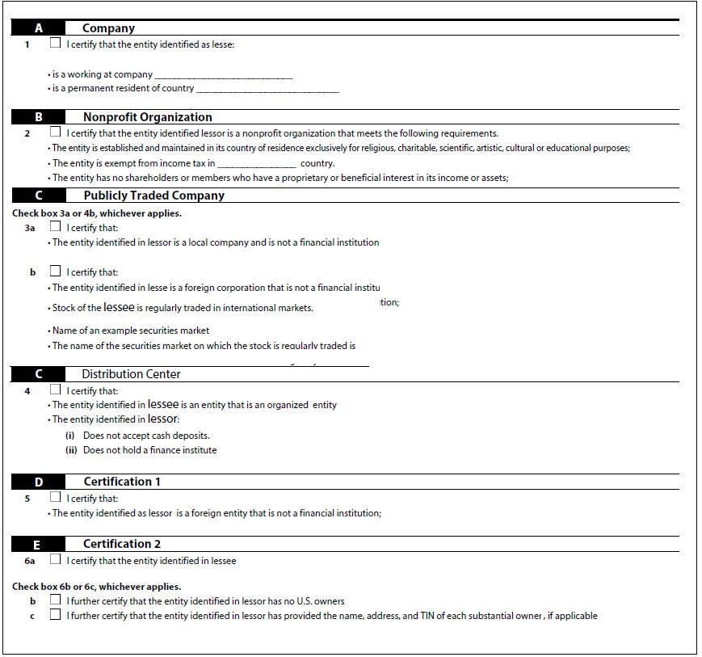

# Best practice e modelli complessi noti {#Best-practices-and-considerations2}

Questo documento fornisce linee guida e raccomandazioni utili per amministratori, autori e sviluppatori di moduli quando lavorano con [!DNL Automated Forms Conversion service]. Descrive le best practice che vanno dalla preparazione dei moduli sorgente alla correzione di modelli complessi che richiedono un ulteriore sforzo per la conversione automatica. Queste best practice contribuiscono collettivamente alle prestazioni e ai risultati complessivi del [!DNL Automated Forms Conversion service].

## Best practice

Il servizio di conversione converte i PDF forms disponibili sul tuo AEM [!DNL Forms] ai moduli adattivi. Le best practice elencate di seguito consentono di migliorare la velocità e l’accuratezza di conversione. Inoltre, queste best practice consentono di risparmiare tempo dedicato alle attività successive alla conversione.

### Prima di caricare l’origine

Se necessario, puoi caricare tutti i PDF forms in una sola volta o in modo graduale. Prima di caricare i moduli, considera quanto segue:

* Mantenere il numero di moduli in una cartella inferiore a 15 e il numero totale di pagine in una cartella inferiore a 50.
* Mantieni le dimensioni della cartella inferiori a 10 MB. Non salvare i moduli in sottocartelle.
* Mantieni il numero di pagine in un modulo inferiore a 15.
* Organizzare i documenti di origine in un batch di 8-15 documenti. Mantieni i moduli sorgente con i frammenti di moduli adattivi comuni in un singolo batch.
* Non caricare i moduli protetti. Il servizio non converte i moduli protetti da password e protetti.
* Non caricare [Portfoli PDF](https://helpx.adobe.com/it/acrobat/using/overview-pdf-portfolios.html). Il servizio non converte un Portfolio di PDF in un modulo adattivo.
* Non caricare moduli di origine con spazi nel nome file. Rimuovere lo spazio dal nome del file prima di caricare i moduli.
* Non caricare moduli digitalizzati, compilati e in lingue diverse da inglese, francese, tedesco, spagnolo, italiano e portoghese. Tali moduli non sono supportati.

Quando utilizzi un modulo XDP per la conversione, esegui i seguenti passaggi prima di caricare i moduli XPD di origine:

* Analizza il modulo XDP e correggi i problemi visivi. Assicurarsi che il documento di origine utilizzi i controlli e le strutture previsti. Ad esempio, è possibile che nel modulo di origine siano presenti caselle di controllo anziché pulsanti di scelta per una singola selezione. Per produrre un modulo adattivo con i componenti desiderati, modifica le caselle di controllo in pulsanti di scelta.
* [Aggiungere associazioni al modulo XDP](http://www.adobe.com/go/learn_aemforms_designer_65) prima di avviare la conversione. Quando le associazioni sono disponibili nel modulo XDP di origine, il servizio applica automaticamente le associazioni ai campi del modulo adattivo corrispondenti durante la conversione. Consente di risparmiare il tempo necessario per applicare manualmente le associazioni.
* [Aggiungere tag Adobe Sign](https://helpx.adobe.com/sign/using/text-tag.html) nel file XDP. Il servizio converte automaticamente i tag Adobe Sign nei campi del modulo adattivo corrispondenti. Forms adattivo supporta un numero limitato di campi Adobe Sign. Per l’elenco completo dei campi supportati, consulta [Utilizzo di Adobe Sign in un modulo adattivo](https://experienceleague.adobe.com/docs/experience-manager-65/forms/adaptive-forms-advanced-authoring/working-with-adobe-sign.html?lang=en) documentazione.
* Se possibile, convertire tabelle complesse in documenti XDP in tabelle semplici. Una tabella con campi modulo in celle di tabella, celle di dimensioni irregolari, celle con estensione di riga o colonna, celle unite, bordi parziali o nessun bordo visibile è considerata una tabella complessa. Una tabella con uno qualsiasi degli elementi sopra menzionati è considerata una tabella complessa.
<!-- * Use sub-forms in XDP documents to create panels in adaptive forms. Service converts each sub-form to one or more adaptive form panels during conversion. -->

### Prima di avviare la conversione

* Creare modelli di moduli adattivi. I modelli consentono di specificare una struttura uniforme per i moduli dell&#39;organizzazione o del reparto.
* Specifica l’intestazione e il piè di pagina nei modelli di moduli adattivi. Il servizio ignora l’intestazione e il piè di pagina dei documenti di origine e utilizza l’intestazione e il piè di pagina specificati nel modello di modulo adattivo.
* Crea temi per moduli adattivi. I temi consentono di conferire un aspetto uniforme alle forme dell&#39;organizzazione o del reparto.
* Configura modello dati modulo per il salvataggio e il recupero da un&#39;origine dati. Crea e configura servizi di lettura e scrittura per il modello dati modulo.
* Crea frammenti di moduli adattivi e configura il servizio in modo che utilizzi i frammenti di moduli adattivi.
* Preparare modelli di flusso di lavoro comuni per i moduli che richiedono l&#39;automazione dei processi aziendali.
* Configura Adobe Analytics, se necessario

## Conoscere pattern complessi

AEM [!DNL Forms Automated Conversion service] utilizza algoritmi di intelligenza artificiale e machine learning per comprendere il layout e i campi del modulo di origine. Ogni servizio di apprendimento automatico apprende continuamente dai dati di origine e produce un output migliorato ad ogni abbandono. Questi servizi imparano dall&#39;esperienza come gli esseri umani.

[!DNL Automated Forms Conversion service] viene addestrato su un ampio insieme di moduli. Identifica facilmente i campi in un modulo di origine e produce moduli adattivi. Tuttavia, ci sono alcuni campi e stili nelle PDF forms che sono facilmente visibili all&#39;occhio umano, ma difficili da capire per il servizio. Il servizio può assegnare ad alcuni campi o stili diversi dai tipi di campi o pannelli applicabili. Di seguito sono elencati tutti i modelli di campo e di stile.

Il servizio inizierebbe a identificare e assegnare campi o pannelli corretti a questi modelli man mano che impara dai dati sorgente. Per il momento, puoi utilizzare [Revisione e correzione](review-correct-ui-edited.md) per risolvere tali problemi. Prima di iniziare a risolvere i problemi o leggere ulteriori informazioni, acquisisci familiarità con [componenti modulo adattivo](https://helpx.adobe.com/experience-manager/6-5/forms/using/introduction-forms-authoring.html).

### Pattern generali {#general}

| Pattern | Esempio |
|--- |--- |
| **Pattern**  Il servizio non converte i PDF forms compilati in un modulo adattivo.   **Risoluzione**  Utilizza moduli adattivi vuoti. |  |
| **Pattern**  Il servizio potrebbe non riconoscere il testo e i campi in un modulo denso.   **Risoluzione**   Aumenta la larghezza tra il testo e i campi di un modulo denso prima di iniziare la conversione. |  |
| **Pattern**  Il servizio non supporta i moduli digitalizzati.   **Risoluzione**  Non utilizzare moduli digitalizzati. |  |
| **Pattern**  Il servizio non estrae immagini e testo all’interno delle immagini.   **Risoluzione**   Aggiungere manualmente immagini o testo ai moduli convertiti. |  |
| **Pattern**  Le tabelle con bordi punteggiati o non chiari non vengono convertite.   **Risoluzione**  Utilizzare le tabelle con bordi e bordi espliciti e chiari. supportati. |  |
| **Pattern**   I moduli adattivi non supportano il testo verticale preconfigurato. Pertanto, il servizio non converte il testo verticale nel testo di Adaptive Forms corrispondente.   **Risoluzione**   Se necessario, utilizza l’editor di moduli adattivi per aggiungere testo verticale. |  |

### Gruppo di scelta  {#choice-group}

| Pattern | Risoluzione |
|--- |--- |
| **Pattern**   Le opzioni del gruppo di scelte con forme diverse da riquadro o cerchio non vengono convertite nei corrispondenti componenti del modulo adattivo.   **Risoluzione**   Modificare le opzioni di scelta delle forme in caselle o cerchi oppure utilizzare l&#39;editor di revisione e correzione per identificare le forme. |  |

### Campi modulo {#form-fields}

| Pattern | Risoluzione |
|--- |--- |
| **Pattern**   Il servizio non identifica i campi senza bordi chiari.   **Risoluzione**   Utilizza l’editor di revisione e correzione per identificare tali campi. |  |
| **Pattern**   Il servizio potrebbe non identificare alcuni campi modulo del gruppo di scelta con didascalie nella parte inferiore o destra di un modulo.   **Risoluzione**   Utilizza l’editor di revisione e correzione per identificare tali campi |  |
| **Pattern**   Il servizio unisce o assegna un tipo errato ad alcuni campi modulo che sono molto vicini tra loro o che non hanno bordi chiari.   **Risoluzione**   Utilizza l’editor di revisione e correzione per identificare tali campi. |  |
| **Pattern**   Il servizio potrebbe non riconoscere i campi con didascalie lontane o con una linea tratteggiata tra la didascalia e il campo di input.   **Risoluzione**   Per risolvere questi problemi, utilizza i campi dei moduli con limiti chiari oppure utilizza l’editor di revisione e correzione. |  |

### Elenchi {#lists}

| Pattern | Risoluzione |
|--- |--- |
| **Pattern**  Gli elenchi contenenti campi modulo vengono uniti o non convertiti nei corrispondenti componenti del modulo adattivo   **Risoluzione**  Per risolvere questi problemi, utilizza i campi dei moduli con limiti chiari oppure utilizza l’editor di revisione e correzione. |  |
| **Pattern**  Il servizio può lasciare non identificati alcuni elenchi nidificati   **Risoluzione**   Per risolvere questi problemi, utilizza l’editor di revisione e correzione. |  |
| **Pattern**   Il servizio unisce tra loro alcuni elenchi contenenti gruppi di scelta   **Risoluzione**   Per risolvere questi problemi, utilizza l’editor di revisione e correzione. |  |

<!--
Comment Type: draft

<h3>Choice groups</h3>
-->

<!--
Comment Type: draft

<ul>
<li>Lists with form fields, nested lists, and nested choice groups are not supported.</li>
<li>Form fields with captions at bottom or right are not supported.</li>
<li>Form fields without borders are not supported.</li>
<li>Hidden form fields are not supported.</li>
<li>Button in PDF forms are not converted to adaptive form buttons.  </li>
<li>Tables with clear explicit boundaries and borders are supported.</li>
<li>Fields with far away captions are not supported.  </li>
<li>Choice groups with only box or circle shaped selectors are supported. </li>
</ul>
-->
