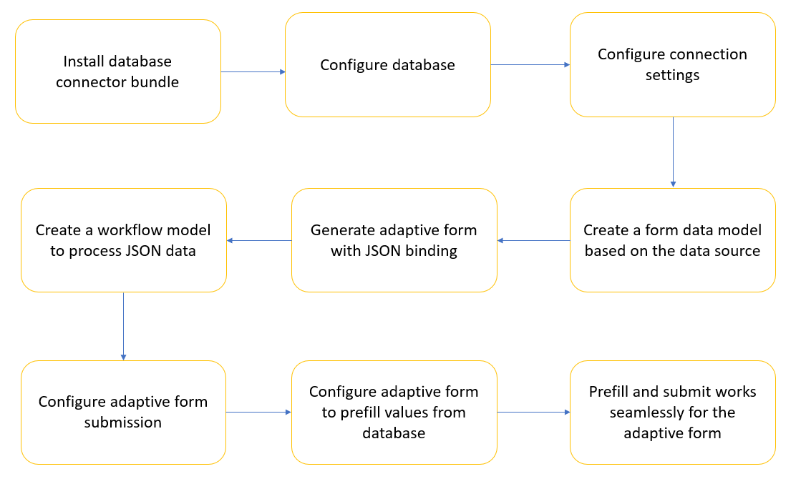
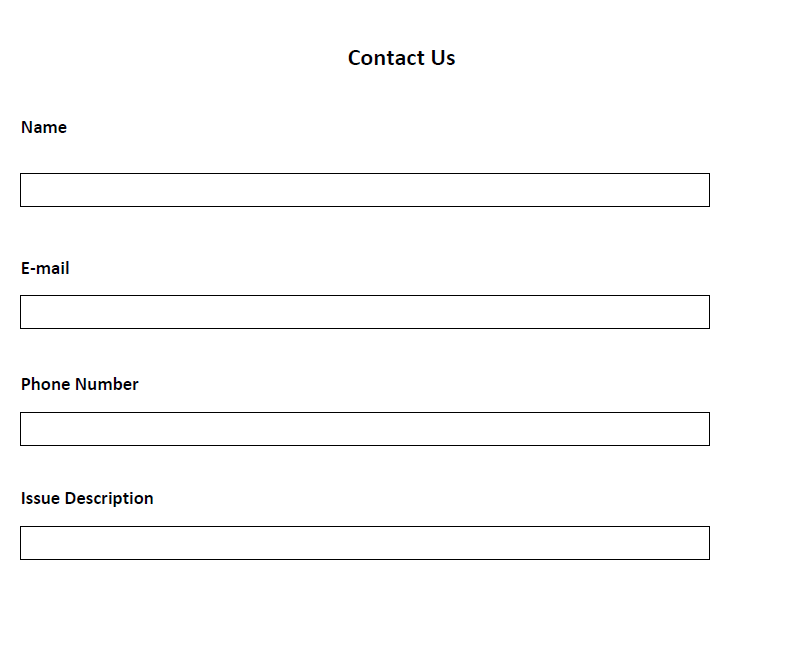
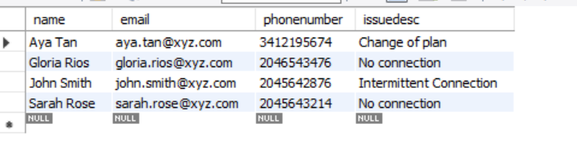
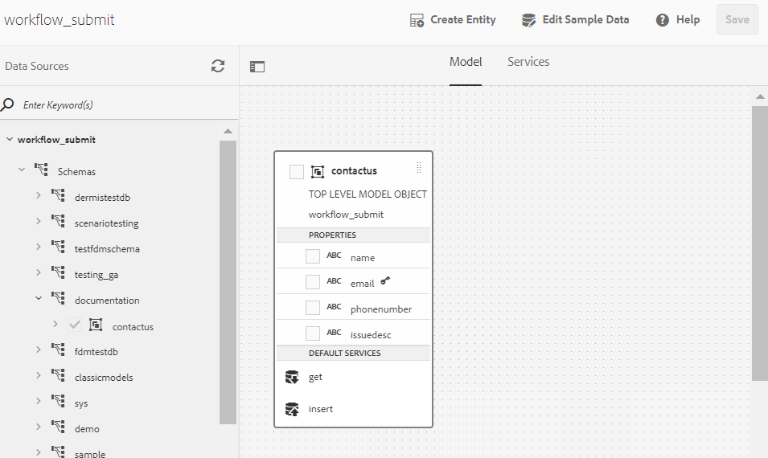
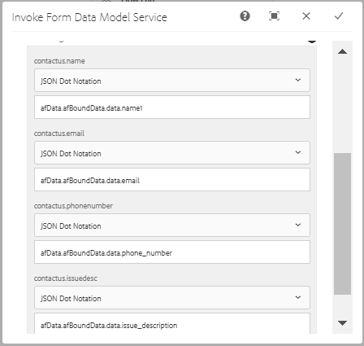
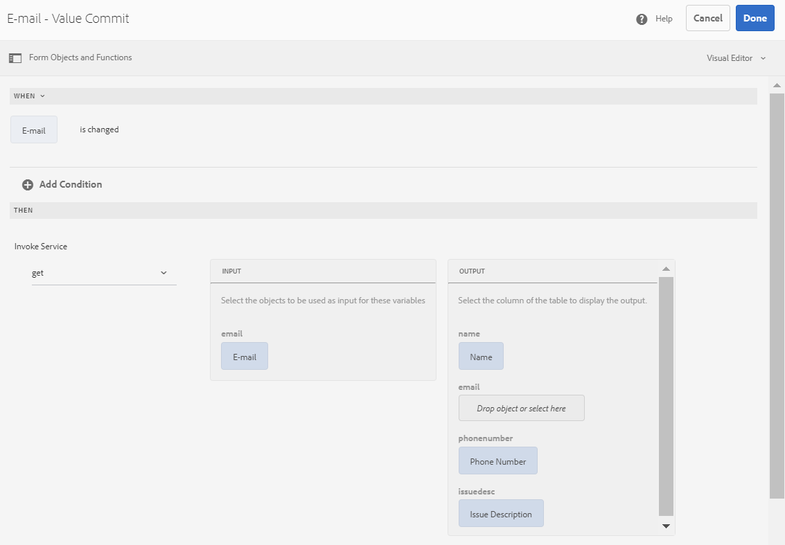

# Integrazione del modulo adattivo con il database utilizzando workflow AEM {#submit-forms-to-database-using-forms-portal}

Il servizio di automated forms conversion consente di convertire un modulo PDF non interattivo, un modulo Acro o un modulo PDF basato su XFA in un modulo adattivo. Quando si avvia il processo di conversione, è possibile generare un modulo adattivo con o senza associazioni di dati.

Se scegli di generare un modulo adattivo senza associazioni di dati, puoi integrare il modulo adattivo convertito con un modello di dati del modulo, uno schema XML o uno schema JSON dopo la conversione. Per il modello dati modulo, è necessario associare manualmente i campi del modulo adattivo al modello dati modulo. Tuttavia, se generi un modulo adattivo con associazioni di dati, il servizio di conversione associa automaticamente i moduli adattivi a uno schema JSON e crea un’associazione di dati tra i campi disponibili nel modulo adattivo e lo schema JSON. Puoi quindi integrare il modulo adattivo con un database a tua scelta, compilare i dati nel modulo e inviarlo al database. Analogamente, una volta completata l’integrazione con il database, è possibile configurare i campi nel modulo adattivo convertito per recuperare i valori dal database e precompilare i campi del modulo adattivo.

La figura seguente illustra diverse fasi dell’integrazione di un modulo adattivo convertito con un database:



Questo articolo descrive le istruzioni dettagliate per eseguire correttamente tutte queste fasi di integrazione.

## Prerequisiti {#pre-requisites}

* Configurare un’istanza di authoring AEM 6.4 o 6.5
* Installa [service pack più recente](https://helpx.adobe.com/it/experience-manager/aem-releases-updates.html) per l’istanza AEM
* Versione più recente del pacchetto del componente aggiuntivo AEM Forms
* Configura [servizio automated forms conversion](configure-service.md)
* Configurare un database. Il database utilizzato nell&#39;implementazione di esempio è MySQL 5.6.24. Tuttavia, puoi integrare il modulo adattivo convertito con qualsiasi database di tua scelta.

## Modulo adattivo di esempio {#sample-adaptive-form}

Per eseguire il caso d’uso per integrare i moduli adattivi convertiti con un database utilizzando un flusso di lavoro AEM, scarica il seguente file PDF di esempio.

Puoi scaricare il modulo Contattaci di esempio utilizzando:

[Ottieni file](assets/sample_contact_us_form.pdf)

Il file PDF funge da input per il servizio di Automated forms conversion. Il servizio converte questo file in un modulo adattivo. Nell&#39;immagine seguente viene illustrato il modulo Contattaci di esempio in formato PDF.



## Installare il file mysql-connector-java-5.1.39-bin.jar {#install-mysql-connector-java-file}

Per installare il file mysql-connector-java-5.1.39-bin.jar, su tutte le istanze di authoring e pubblicazione, effettua le seguenti operazioni:

1. Accedi a `http://server:port/system/console/depfinder` e cercare il pacchetto com.mysql.jdbc.
1. Nella colonna Esportato da, controlla se il pacchetto viene esportato da un bundle. Procedi se il pacchetto non viene esportato da alcun bundle.
1. Accedi a `http://server:port/system/console/bundles` e fai clic su **[!UICONTROL Install/Update]**.
1. Clic **[!UICONTROL Choose File]** e seleziona il file mysql-connector-java-5.1.39-bin.jar. Inoltre, seleziona **[!UICONTROL Start Bundle]** e **[!UICONTROL Refresh Packages]** caselle di controllo.
1. Clic **[!UICONTROL Install]** o **[!UICONTROL Update]**. Al termine, riavviare il server.
1. (Solo per Windows) Disattivare il firewall di sistema per il sistema operativo in uso.

## Prepara dati per modello modulo {#prepare-data-for-form-model}

L’integrazione dei dati di AEM Forms consente di configurare e connettersi a diverse origini dati. Dopo aver generato un modulo adattivo utilizzando il processo di conversione, puoi definire il modello del modulo in base a un modello di dati del modulo, XSD o uno schema JSON. È possibile utilizzare un database, Microsoft Dynamics o qualsiasi altro servizio di terze parti per creare un modello di dati modulo.

Questa esercitazione utilizza il database MySQL come origine per la creazione di un modello di dati modulo. Crea uno schema nel database e aggiungi **contatto** nello schema in base ai campi disponibili nel modulo adattivo.



È possibile utilizzare la seguente istruzione DDL per creare **contatto** tabella nel database.

```sql
CREATE TABLE `contactus` (
   `name` varchar(45) NOT NULL,
   `email` varchar(45) NOT NULL,
   `phonenumber` varchar(10) DEFAULT NULL,
   `issuedesc` varchar(1000) DEFAULT NULL,
   PRIMARY KEY (`email`)
 ) ENGINE=InnoDB DEFAULT CHARSET=utf8
```

## Configurare la connessione tra l’istanza AEM e il database {#configure-connection-between-aem-instance-and-database}

Per creare una connessione tra l&#39;istanza AEM e il database MYSQL, effettuare le seguenti operazioni di configurazione:

1. Vai alla pagina Configurazione della console web AEM all’indirizzo `http://server:port/system/console/configMgr`.
1. Trova e fai clic per aprire **[!UICONTROL Apache Sling Connection Pooled DataSource]** in modalità di modifica nella configurazione della console web. Specificare i valori per le proprietà come descritto nella tabella seguente:

   <table> 
    <tbody> 
    <tr> 
    <th><strong>Proprietà</strong></th> 
    <th><strong>Valore</strong></th> 
    </tr> 
    <tr> 
    <td><p>Nome origine dati</p></td> 
    <td><p>Nome dell'origine dati per filtrare i driver dal pool di origini dati.</p></td>
    </tr>
    <tr> 
    <td><p>Classe driver JDBC</p></td> 
    <td><p>com.mysql.jdbc.Driver</p></td>
    </tr>
    <tr> 
    <td><p>URI connessione JDBC</p></td> 
    <td><p>jdbc:mysql://[host]:[porta]/[nome_schema]</p></td>
    </tr>
    <tr> 
    <td><p>Nome utente</p></td> 
    <td><p>Un nome utente per autenticare ed eseguire azioni sulle tabelle del database</p></td>
    </tr>
    <tr> 
    <td><p>Password</p></td> 
    <td><p>Password associata al nome utente</p></td>
    </tr>
    <tr> 
    <td><p>Isolamento transazione</p></td> 
    <td><p>READ_COMMIT</p></td>
    </tr>
    <tr> 
    <td><p>Numero massimo connessioni attive</p></td> 
    <td><p>1000</p></td>
    </tr>
    <tr> 
    <td><p>Numero massimo di connessioni inattive</p></td> 
    <td><p>100</p></td>
    </tr>
    <tr> 
    <td><p>Connessioni inattive minime</p></td> 
    <td><p>10</p></td>
    </tr>
    <tr> 
    <td><p>Dimensione iniziale</p></td> 
    <td><p>10</p></td>
    </tr>
    <tr> 
    <td><p>Attesa massima</p></td> 
    <td><p>100000</p></td>
    </tr>
     <tr> 
    <td><p>Test su prestito</p></td> 
    <td><p>Selezionato</p></td>
    </tr>
     <tr> 
    <td><p>Test durante inattività</p></td> 
    <td><p>Selezionato</p></td>
    </tr>
     <tr> 
    <td><p>Query di convalida</p></td> 
    <td><p>I valori di esempio sono SELECT 1(mysql), select 1 from dual(oracle), SELECT 1(MS Sql Server) (validationQuery)</p></td>
    </tr>
     <tr> 
    <td><p>Timeout query di convalida</p></td> 
    <td><p>10000</p></td>
    </tr>
    </tbody> 
    </table>

## Crea modello dati modulo {#create-form-data-model}

Dopo aver configurato MYSQL come origine dati, eseguire i passaggi seguenti per creare un modello dati del modulo:

1. Nell’istanza di authoring dell’AEM, passa a **[!UICONTROL Forms]** > **[!UICONTROL Data Integrations]**.

1. Tocca **[!UICONTROL Create]** > **[!UICONTROL Form Data Model]**.

1. In **[!UICONTROL Create Form Data Model]** procedura guidata, specifica **workflow_submit** come nome del modello dati del modulo. Tocca **[!UICONTROL Next]**.

1. Seleziona l’origine dati MYSQL configurata nella sezione precedente e tocca **[!UICONTROL Create]**.

1. Tocca **[!UICONTROL Edit]** ed espandi l’origine dati elencata nel riquadro a sinistra per selezionare **contatto** tabella, **[!UICONTROL get]**, e **[!UICONTROL insert]** e toccare **[!UICONTROL Add Selected]**.

   

1. Seleziona l’oggetto modello dati nel riquadro a destra e tocca **[!UICONTROL Edit Properties]**. Seleziona **[!UICONTROL get]** e **[!UICONTROL insert]** da **[!UICONTROL Read Service]** e **[!UICONTROL Write Service]** elenchi a discesa. Specifica gli argomenti per il servizio Read e tocca **[!UICONTROL Done]**.

1. In **[!UICONTROL Services]** , seleziona la scheda **[!UICONTROL get]** servizio e tocco **[!UICONTROL Edit Properties]**. Seleziona la **[!UICONTROL Output Model Object]**, disattiva la **[!UICONTROL Return array]** attiva e tocca **[!UICONTROL Done]**.

1. Seleziona la **[!UICONTROL Insert]** servizio e tocco **[!UICONTROL Edit Properties]**. Seleziona la **[!UICONTROL Input Model Object]** e tocca **[!UICONTROL Done]**.

1. Tocca **[!UICONTROL Save]** per salvare il modello dati del modulo.

Puoi scaricare il modello dati del modulo di esempio utilizzando:

[Ottieni file](assets/DownloadedFormsPackage_1497728018502500.zip)

## Generare moduli adattivi con binding JSON {#generate-adaptive-forms-with-json-binding}

Utilizza il [Servizio automated forms conversion da convertire](convert-existing-forms-to-adaptive-forms.md) il [Modulo Contattaci](#sample-adaptive-form) in un modulo adattivo con associazione dati. Assicurati di non selezionare **[!UICONTROL Generate adaptive form(s) without data bindings]** durante la generazione del modulo adattivo.


Seleziona il file convertito **Modulo Contattaci** disponibile in **[!UICONTROL output]** cartella in **[!UICONTROL Forms & Documents]** e tocca **[!UICONTROL Edit]**. Tocca **[!UICONTROL Preview]**, immetti i valori nei campi del modulo adattivo e tocca **[!UICONTROL Submit]**.

Accedi a **crx-repository** e passa a */content/forms/fp/admin/submit/data* per visualizzare i valori inviati in formato JSON. Di seguito sono riportati i dati di esempio in formato JSON quando si invia il file convertito **Contattaci** modulo adattivo:

```json
{
  "afData": {
    "afUnboundData": {
      "data": {}
    },
    "afBoundData": {
      "data": {
        "name1": "Gloria",
        "email": "abc@xyz.com",
        "phone_number": "2346578965",
        "issue_description": "Test message"
      }
    },
    "afSubmissionInfo": {
      "computedMetaInfo": {},
      "stateOverrides": {},
      "signers": {},
      "afPath": "/content/dam/formsanddocuments/docs_conversion/output/sample_form_json",
      "afSubmissionTime": "20191204014007"
    }
  }
}
```

È necessario creare ora un modello di flusso di lavoro in grado di elaborare questi dati e inviarli al database MYSQL utilizzando il modello dati del modulo creato nelle sezioni precedenti.

## Creare un modello di flusso di lavoro per elaborare i dati JSON {#create-workflow-model}

Per creare un modello di flusso di lavoro per inviare i dati del modulo adattivo al database, effettua le seguenti operazioni:

1. Apri la console Modelli di flusso di lavoro. L’URL predefinito è `https://server:port/libs/cq/workflow/admin/console/content/models.html/etc/workflow/models`.

1. Seleziona **[!UICONTROL Create]**, quindi **[!UICONTROL Create Model]**. Il **[!UICONTROL Add Workflow Model]** viene visualizzata.

1. Inserisci il **[!UICONTROL Title]** e **[!UICONTROL Name]** (facoltativo). Ad esempio: **workflow_json_submit**. Tocca **[!UICONTROL Done]** per creare il modello.

1. Seleziona il modello di flusso di lavoro e tocca **[!UICONTROL Edit]** per aprire il modello in modalità di modifica. Tocca + e aggiungi **[!UICONTROL Invoke Form Data Model Service]** passa al modello di flusso di lavoro.

1. Tocca il **[!UICONTROL Invoke Form Data Model Service]** passo e tocco .

1. In **[!UICONTROL Form Data Model]** , selezionare il modello dati del modulo creato in **[!UICONTROL Form Data Model path]** e seleziona **[!UICONTROL insert]** dal **[!UICONTROL Service]** elenco a discesa.

1. In **[!UICONTROL Input for Service]** , seleziona **[!UICONTROL Provide input data using literal, variable, or a workflow metadata, and a JSON file]** dall’elenco a discesa, seleziona **[!UICONTROL Map input fields from input JSON]** , seleziona **[!UICONTROL Relative to payload]**, e fornire **data.xml** come valore per **[!UICONTROL Select input JSON document using]** campo.

1. In **[!UICONTROL Service Arguments]** , fornire i seguenti valori per gli argomenti del modello dati modulo:

   

   I campi del modello dati del modulo, ad esempio il nome del punto di contatto, sono mappati a **afData.afBoundData.data.name1**, che fa riferimento alle associazioni dello schema JSON per il modulo adattivo inviato.

## Configurare l’invio di moduli adattivi {#configure-adaptive-form-submission}

Per inviare il modulo adattivo al modello di flusso di lavoro creato nella sezione precedente, effettua le seguenti operazioni:

1. Selezionare il modulo convertito Contattaci disponibile nella **[!UICONTROL output]** cartella in **[!UICONTROL Forms & Documents]** e tocca **[!UICONTROL Edit]**.

1. Apri le proprietà del modulo adattivo toccando **[!UICONTROL Form Container]** e quindi tocca .

1. In **[!UICONTROL Submission]** sezione, seleziona **[!UICONTROL Invoke an AEM workflow]** dal **[!UICONTROL Submit Action]** , selezionare il modello di flusso di lavoro creato nella sezione precedente e specificare **data.xml** nel **[!UICONTROL Data File Path]** campo.

1. Tocca  per salvare le proprietà.

1. Tocca **[!UICONTROL Preview]**, immetti i valori nei campi del modulo adattivo e tocca **[!UICONTROL Submit]**. I valori inviati ora vengono visualizzati nella tabella del database MYSQL anziché **crx-repository**.

## Configura il modulo adattivo per la precompilazione dei valori dal database

Esegui la procedura seguente per configurare il modulo adattivo per la precompilazione dei valori dal database MYSQL in base alla chiave primaria definita nella tabella (in questo caso, invia un messaggio e-mail):

1. Tocca il **E-mail** nel modulo adattivo e tocca .

1. Tocca **[!UICONTROL Create]** e seleziona **[!UICONTROL is changed]** dal **[!UICONTROL Select State]** elenco a discesa nella **[!UICONTROL When]** sezione.

1. In **[!UICONTROL Then]** sezione, seleziona **[!UICONTROL Invoke Service]** e **ottenere** come servizio per il modello dati del modulo creato in una sezione precedente di questo articolo.

1. Seleziona **E-mail** nel **[!UICONTROL Input]** e gli altri tre campi del modello dati del modulo, **Nome**, **Numero di telefono**, e **Descrizione problema** nel **[!UICONTROL Output]** sezione. Tocca **[!UICONTROL Done]** per salvare le impostazioni.

   

   Di conseguenza, in base alle voci di posta elettronica esistenti nel database MYSQL, è possibile precompilare i valori per i restanti tre campi nel **[!UICONTROL Preview]** modalità del modulo adattivo. Ad esempio, se specifichi aya.tan@xyz.com nel **E-mail** (in base ai dati esistenti in [Prepara modello dati modulo](#prepare-data-for-form-model) sezione di questo articolo) e tabulazione del campo, i restanti tre campi, **Nome**, **Numero di telefono**, e **Descrizione problema** viene visualizzata automaticamente nel modulo adattivo.

Puoi scaricare il modulo adattivo convertito di esempio utilizzando:

[Ottieni file](assets/DownloadedFormsPackage_1498226829041200.zip)
